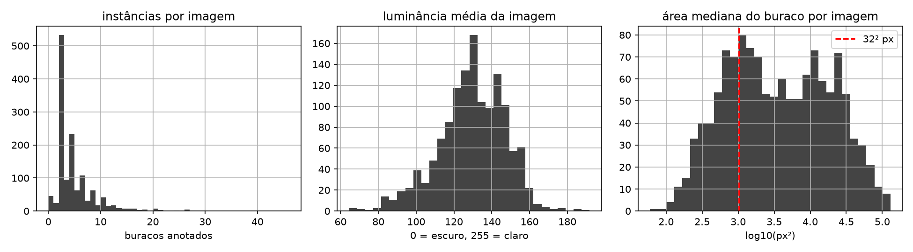
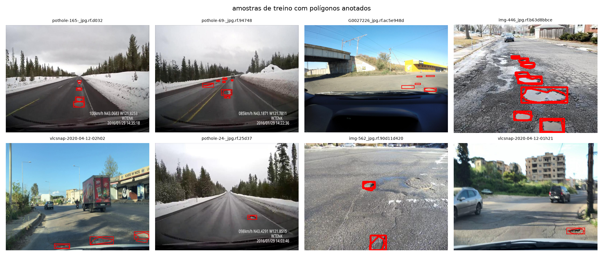
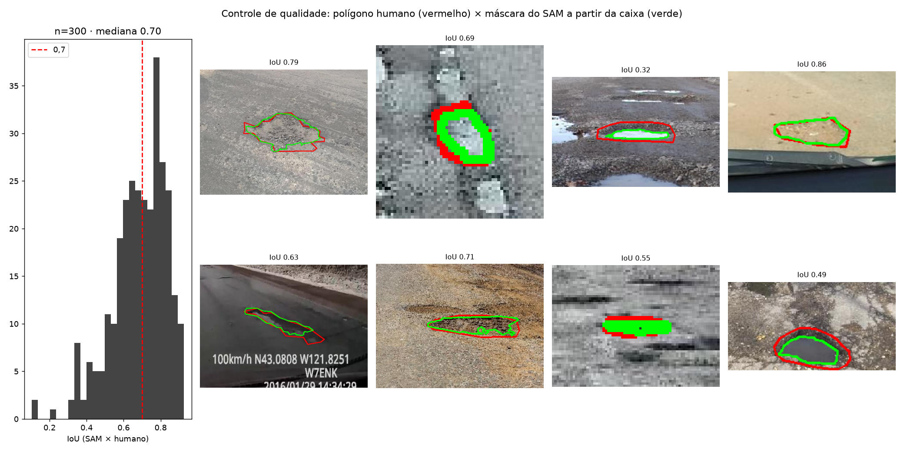
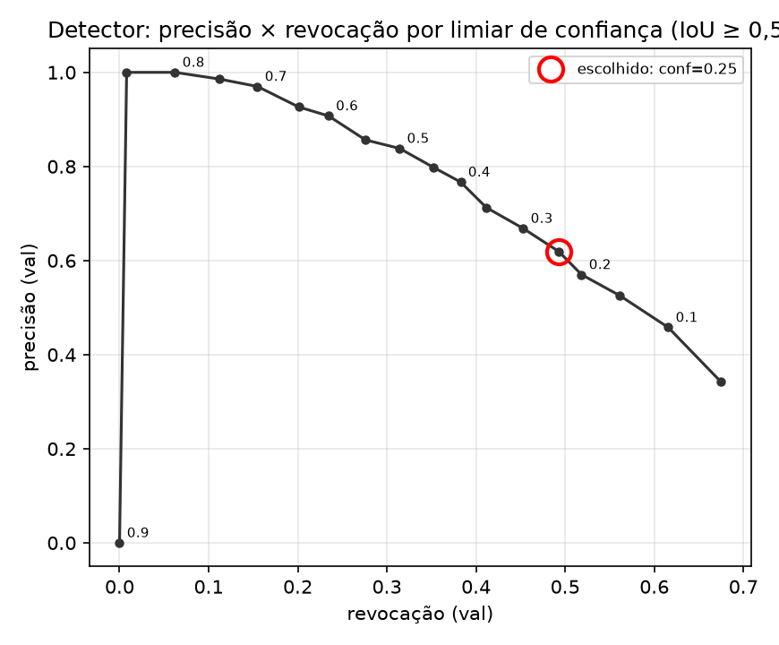
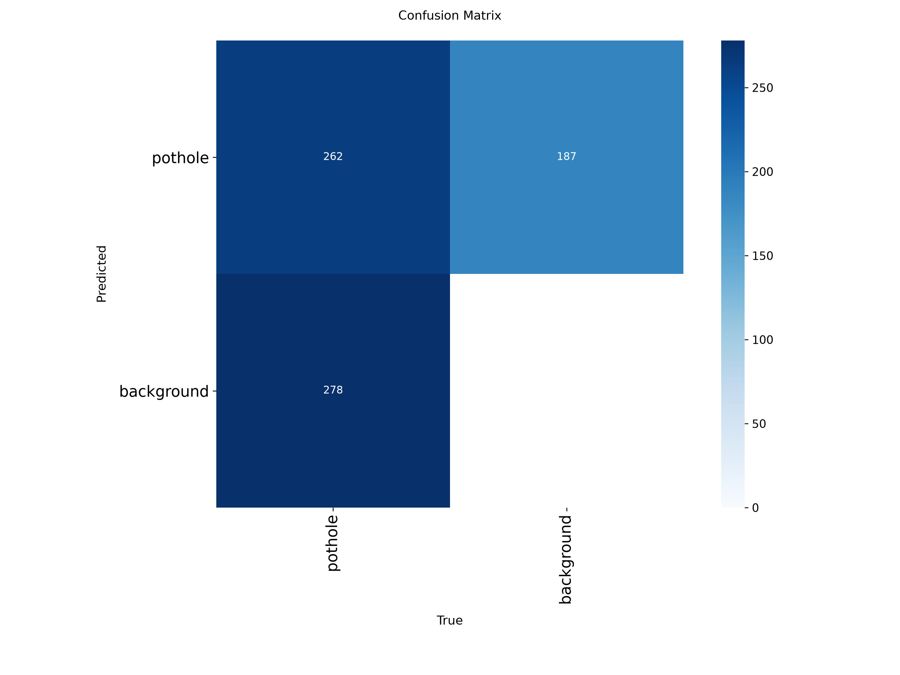
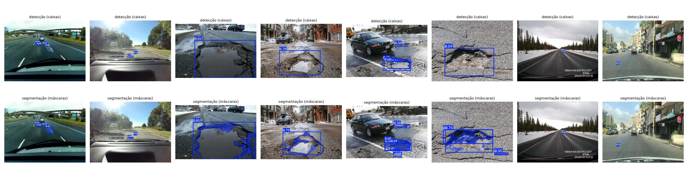
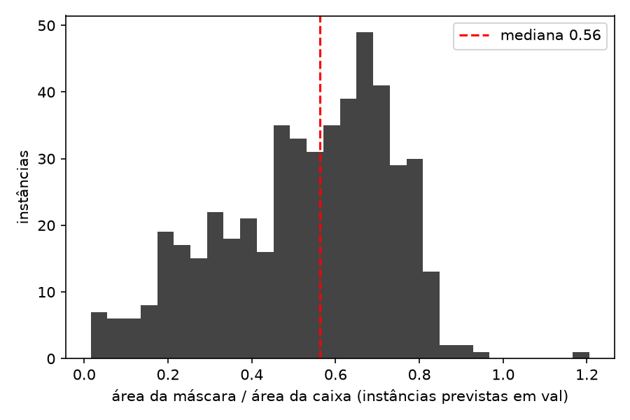
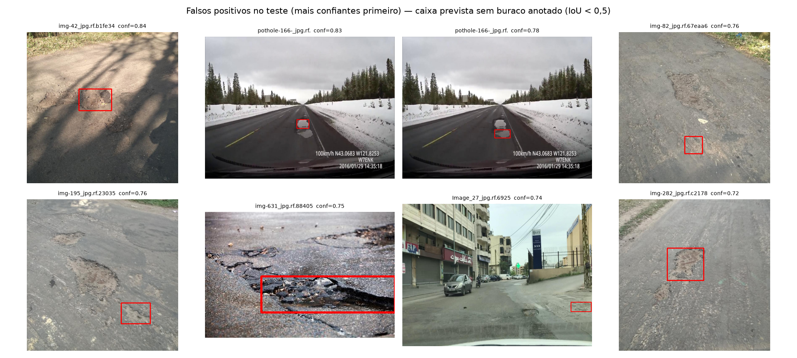
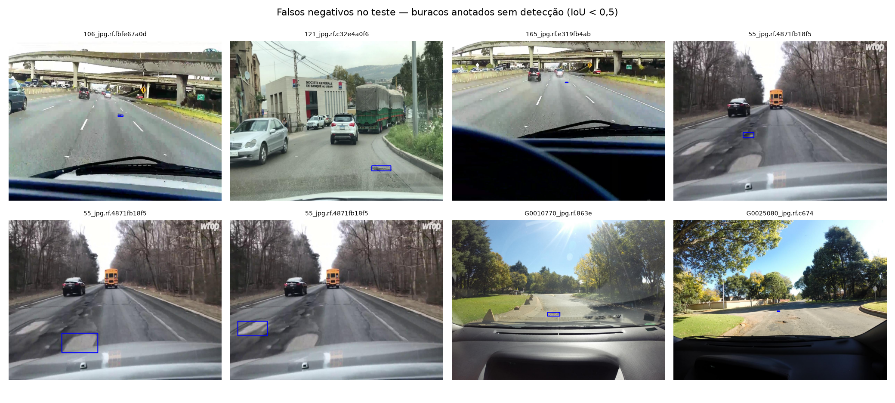

# Detecção e segmentação de buracos em vias urbanas com YOLO11

### Sistematização — Visão Computacional e Reconhecimento de Padrões

| | |
|---|---|
| **Disciplina** | Visão Computacional e Reconhecimento de Padrões — Prof. Dr. Romes Heriberto Pires de Araújo |
| **Integrantes** | Diego Nunes de Morais <!-- adicionar os demais --> |
| **Data** | 20 de setembro de 2026 |
| **Cenário** | Cidades Inteligentes — buracos em vias |
| **Repositório** | [https://github.com/diegoedataengineer/sistematizacao-visao-computacional](https://github.com/diegoedataengineer/sistematizacao-visao-computacional) |
| **Pesos treinados** | Release `v1.0` — `det_s_best.pt`, `seg_s_best.pt`, `baseline_n_best.pt` |
| **Vídeo com inferência** | <!-- link (domingo) --> |
| **Vídeo-pitch** | <!-- link (domingo) --> |

---

## 1. Introdução

Este documento descreve a construção, ponta a ponta, de um sistema que **detecta** e **segmenta** buracos em vias urbanas a partir de imagens capturadas por veículos em circulação, e demonstra o sistema em vídeo. O escopo cobre a escolha e a inspeção do dataset, a correção e o refino das anotações, o treino de um detector e de um segmentador de instâncias, a avaliação com protocolo de teste único, a análise de erros e a aplicação em vídeo com rastreamento.

Duas escolhas orientaram o trabalho e explicam boa parte dos resultados adiante.

A primeira é **não confiar nas anotações do dataset sem inspecioná-las**. O dataset público escolhido misturava, nos mesmos arquivos, instâncias anotadas por caixa e por polígono; a biblioteca de treino descartava esses arquivos em silêncio, e o primeiro treino usou 59 das 1 076 imagens sem avisar. Detectar isso, corrigir o formato e refinar as máscaras com um modelo de fundação (SAM) consumiu a primeira noite e mudou o que o número de segmentação significa (seção 3).

A segunda é **medir o desempenho realizável, não o aparente**. O conjunto de teste foi avaliado uma única vez, com limiar e modelo escolhidos em validação; o mAP é calculado no protocolo padrão, mas a precisão e a revocação que reportamos são as do ponto de operação que um sistema real usaria, e os erros foram inspecionados um a um. O resultado inclui um achado desconfortável: boa parte dos "falsos positivos" mais confiantes são buracos reais que o dataset não anotou.

Todas as decisões de projeto estão registradas em ADRs (`docs/adr/`), com contexto, alternativas descartadas e consequências. **Todo número deste relatório vem de execução real**, gravado em `figs/resultados.json`, `figs/tabela_final.csv` e `runs/`, incluindo os desfavoráveis.

---

## 2. Descrição do problema

Prefeituras recebem reclamações de buracos de forma dispersa e sem medida do dano. O que uma equipe de manutenção precisa é de uma lista priorizável: **onde** há buracos, **quantos** são por trecho e **qual a extensão** de cada um. Três características definem o problema:

**Detecção e segmentação são tarefas complementares, não redundantes.** A caixa localiza e conta; a máscara mede. Um buraco alongado ou diagonal ocupa uma fração pequena da sua caixa — a seção 6.3 quantifica isso — e priorizar por área da caixa superestimaria o dano.

**O custo dos erros é assimétrico.** Um buraco não detectado (falso negativo) some da lista de manutenção; um alarme falso (falso positivo) custa a revisão de um operador. O ponto de operação do detector foi escolhido com essa assimetria em mente (seção 8).

**O sistema opera em vídeo, de um veículo em movimento.** Isso impõe um detector de um estágio, em tempo real, e um rastreador para não contar o mesmo buraco duas vezes (seção 9).

Trabalhamos com classe única (`pothole`). Rachaduras, remendos e tampas de bueiro não são alvo e aparecem na análise de erros como confusores.

---

## 3. Dataset utilizado

**Potholes and Roads Instance Segmentation**, workspace `pothole-vsmtu`, Roboflow Universe, versão 5, licença CC BY 4.0, obtido em 18/09/2026 em [universe.roboflow.com/pothole-vsmtu/potholes-and-roads-instance-segmentation/dataset/5](https://universe.roboflow.com/pothole-vsmtu/potholes-and-roads-instance-segmentation/dataset/5). O dataset original tem duas classes (`pothole`, `road`); mantivemos apenas `pothole`. Os três splits são os do próprio dataset, sem redistribuição.

| Característica | Valor |
|---|---|
| Imagens | 1 355 — treino 1 076 · validação 138 · teste 141 |
| Instâncias `pothole` | 6 264 — treino 5 097 · validação 627 · teste 540 |
| Instâncias por imagem | 4,7 (treino) · 4,5 (validação) · 3,8 (teste) |
| Imagens sem buraco | 29 · 6 · 11 |
| Resoluções dominantes | 1227×920 (714 imagens) · 720×720 (280) · ~400×300 (poucas) |
| Instâncias pequenas (< 32² px) | 40% · 41% · 37% |
| Anotação | polígonos (45%) e caixas (55%) — ver 3.1 |

### 3.1 Uma armadilha nas anotações

Na inspeção das labels, 2 834 instâncias (45%) estavam em polígono e 3 430 (55%) apenas em caixa (cinco números por linha), misturadas nos mesmos arquivos — 1 270 arquivos com os dois formatos. O Ultralytics **rejeita arquivos que misturam caixa e polígono** ("labels mix") e os descarta como corrompidos, sem erro visível. O primeiro treino terminou em três minutos: havia usado 59 imagens de treino e 9 de validação. Detectamos o problema pelo tamanho anômalo do conjunto de validação no log, e não pela biblioteca.

A correção converte cada caixa em um polígono retangular de quatro pontos (`scripts/filtrar_classes.py`) e apaga os caches de labels. Para a detecção isso é neutro — as caixas são derivadas dos polígonos. Para a segmentação, significava que mais da metade das máscaras de referência seriam retângulos, e a métrica de máscara mediria, em parte, "quão bem o modelo desenha retângulos".

### 3.2 Análise exploratória



Três observações da exploração condicionam o que vem depois. A distribuição de instâncias por imagem tem moda em duas e cauda longa (há imagens com mais de vinte buracos anotados): cenas de dashcam em rodovia alternam com fotos a pé de trechos muito degradados. A luminância média concentra-se entre 100 e 160 — cenas diurnas, sem noite; o modelo não foi exposto a condições noturnas. E **cerca de 40% das instâncias têm menos de 32² pixels**: buracos distantes, de poucos pixels, que antecipam a dificuldade de revocação discutida na seção 7.



As amostras mostram a heterogeneidade do domínio: rodovias com neve (dashcam com sobreposição de velocidade e coordenadas), ruas urbanas com carros e caminhões, fotos de perto de asfalto molhado. Também mostram os confusores que reaparecem nos erros — uma tampa de bueiro ao lado de um buraco, remendos escuros, poças.

### 3.3 Refino das máscaras com SAM

Para recuperar contornos reais nas 3 430 instâncias anotadas só por caixa, geramos a máscara de cada uma com o *Segment Anything Model* (ViT-B), usando a caixa humana como prompt, recortando a máscara pela caixa e mantendo o maior componente conexo (`scripts/refinar_mascaras_sam.py`). A pergunta que precisava de resposta antes de substituir as anotações era: **a máscara do SAM é melhor que o retângulo?**

Medimos isso em 300 instâncias que **tinham** polígono humano, derivando a caixa do polígono, pedindo a máscara ao SAM e comparando as duas coisas com o polígono original. A mesma amostra serviu para medir o retângulo.

| Referência comparada ao polígono humano | IoU mediano | IoU médio | P10 | P90 | ≥ 0,7 |
|---|---|---|---|---|---|
| Retângulo (a anotação original das instâncias só-caixa) | 0,684 | 0,669 | 0,522 | 0,790 | 43% |
| Máscara do SAM a partir da caixa | **0,703** | **0,685** | 0,497 | **0,851** | **51%** |



O ganho na mediana é modesto, e o motivo está na figura: os polígonos humanos desta base são pouco precisos — um simples retângulo já concorda 0,68 com eles. Nos casos de IoU baixo (0,32 e 0,49 na figura), é o polígono humano que engloba asfalto ao redor do buraco; o contorno do SAM segue a borda real. O SAM supera o retângulo em todas as estatísticas, com ganho maior na cauda alta (P90 0,85 contra 0,79), e foi adotado como referência para treino e teste de segmentação. As anotações originais foram preservadas (`labels_original/`) para que a avaliação reporte as métricas contra as duas versões (seção 6.3). Das 3 430 caixas, 3 429 foram refinadas; uma permaneceu retângulo por o SAM não devolver máscara válida.

---

## 4. Metodologia adotada

### 4.1 Papéis dos conjuntos

Três conjuntos com papéis estritos. `train` ajusta os pesos. `val` escolhe o modelo (`best.pt` pelo *fitness* do Ultralytics), o limiar de confiança e o IoU do NMS. `test` foi avaliado **uma única vez** ao final, com todos os parâmetros congelados, e o resultado entrou neste relatório sem retoque. A seção 11 registra, por honestidade, duas execuções sobre o teste que foram descartadas por erro de configuração antes da avaliação final.

### 4.2 Escolha dos modelos

**Detecção: YOLO11s** (Ultralytics 8.4.155), fine-tuning a partir dos pesos pré-treinados no COCO. Um detector de um estágio porque o cenário é vídeo de veículo em movimento, com requisito de tempo real e implantação futura embarcada; Faster R-CNN seria a escolha para imagens estáticas de alta resolução onde a latência não importa. Baseline: YOLO11n por 30 épocas.

**Segmentação: YOLO11s-seg**, sobre as mesmas imagens e o mesmo `data.yaml`, com protocolo idêntico ao do detector. Segmentação de **instâncias**, porque buracos se contam e se medem um a um; U-Net e DeepLab (semântica) perderiam a noção de instância, e Mask R-CNN exigiria outro pipeline de treino sem ganho justificável no prazo.

**Nenhum treino do zero.** Com 1 076 imagens, transferir de pesos pré-treinados é o caminho padrão; a comparação com um modelo maior (YOLO11m) na seção 6.4 confirma que capacidade adicional não se converte em desempenho nesta escala de dados.

### 4.3 Ponto de operação

Detectores produzem scores; o limiar transforma score em decisão e é uma escolha de custo, não um detalhe técnico. Varremos o limiar de confiança de 0,05 a 0,90 em validação, com precisão e revocação calculadas por **casamento um-para-um** (guloso por score, IoU ≥ 0,5) a partir de uma única inferência em `conf = 0,001`:

| conf | 0,10 | 0,15 | 0,20 | **0,25** | 0,30 | 0,35 | 0,40 | 0,50 | 0,60 |
|---|---|---|---|---|---|---|---|---|---|
| Precisão | 0,458 | 0,525 | 0,570 | **0,619** | 0,668 | 0,713 | 0,767 | 0,838 | 0,907 |
| Revocação | 0,616 | 0,561 | 0,518 | **0,493** | 0,453 | 0,411 | 0,383 | 0,314 | 0,234 |
| F1 | 0,525 | 0,543 | 0,543 | **0,549** | 0,540 | 0,522 | 0,511 | 0,457 | 0,373 |



A regra inicial do projeto (ADR-S05) era "maior revocação com precisão ≥ 0,70", pensada antes de ver a curva; aplicada a este modelo, ela escolheria `conf = 0,35` e perderia 59% dos buracos. Apresentamos ao grupo três opções com os números reais — piso de precisão 0,70, máximo F1, piso 0,55 — e adotamos o **máximo F1: `conf = 0,25`**, precisão 0,62 e revocação 0,49 em validação. É a regra mais defensável e, para manutenção viária, o custo de um buraco não detectado pesa mais que o de um alarme revisado por um operador. `IoU NMS = 0,7`. O mesmo limiar vale para teste, vídeo e demonstração.

### 4.4 Métricas

**mAP@0,5 e mAP@0,5:0,95** (caixas e máscaras), pelo Ultralytics no limiar padrão 0,001 — o protocolo COCO; **precisão e revocação no ponto de operação**, por casamento um-para-um com IoU ≥ 0,5 — o que um sistema real entrega com `conf = 0,25`; **matriz de confusão**; **IoU e Dice por imagem** das máscaras, contra as referências refinadas e contra as originais; **análise qualitativa** de falsos positivos e negativos e revocação por tamanho. Acurácia não aparece: com classe única e fundo dominante, seria alta e inútil.

---

## 5. Pipeline de treino

| Parâmetro | Valor |
|---|---|
| Modelos base | `yolo11s.pt` / `yolo11s-seg.pt` (COCO) · baseline `yolo11n.pt` |
| Épocas / parada antecipada | 50 / *patience* 10 — nenhum treino parou antes das 50 |
| Tamanho de imagem | 640 (extras: 800) |
| Batch | 16 |
| Otimizador | escolhido automaticamente pelo Ultralytics (`auto`), lr0 0,01, momentum 0,937, weight decay 0,0005 |
| Augmentation | padrão Ultralytics: mosaic 1,0 · fliplr 0,5 · hsv_h/s/v 0,015/0,7/0,4 · scale 0,5 · translate 0,1 |
| Seed / determinístico | 0 / sim |
| Camadas congeladas | nenhuma |
| Hardware | GTX 1060 6 GB (local) |

| Treino | Épocas | Tempo | s/época |
|---|---|---|---|
| YOLO11n (baseline) | 30 | 31 min | 62 |
| YOLO11s — detecção | 50 | 55 min | 67 |
| YOLO11s-seg — segmentação | 50 | 75 min | 90 |
| YOLO11s @ 800 px (extra) | 50 | 100 min | 120 |
| YOLO11m (extra) | 50 | 120 min | 144 |


No detector, a perda de caixa caiu de 1,68 para 1,10 no treino e de 1,84 para 1,19 na validação; o melhor mAP@0,5:0,95 em validação (0,294) ocorreu na época 44 de 50 e a perda de validação ainda caía ao final. As duas perdas caem juntas: não há sinal de sobreajuste forte, e mais épocas provavelmente renderiam um pouco mais.

O pipeline inteiro — download, filtro das labels, EDA, controle de qualidade e refino com SAM, cinco treinos, avaliação — rodou sem intervenção manual durante a noite (`scripts/pipeline.sh`), com retomada automática a partir do último checkpoint em caso de interrupção.

---

## 6. Resultados experimentais

### 6.1 Desempenho em validação e no teste

`conf = 0,25` · `IoU NMS = 0,7` · `imgsz = 640` (exceto onde indicado). O teste foi avaliado uma única vez.

| Modelo | Split | mAP@0,5 | mAP@0,5:0,95 | Precisão | Revocação | Mask mAP@0,5 | Mask mAP@0,5:0,95 |
|---|---|---|---|---|---|---|---|
| **YOLO11s — principal** | val | 0,498 | 0,298 | 0,619 | 0,493 | — | — |
| **YOLO11s — principal** | **teste** | **0,487** | **0,287** | **0,645** | **0,518** | — | — |
| YOLO11n (baseline, 30 ép.) | val | 0,437 | 0,234 | 0,640 | 0,431 | — | — |
| YOLO11n (baseline, 30 ép.) | teste | 0,421 | 0,201 | 0,612 | 0,450 | — | — |
| YOLO11s @ 800 px (extra) | val | 0,508 | 0,302 | 0,647 | 0,501 | — | — |
| YOLO11s @ 800 px (extra) | teste | 0,517 | 0,306 | 0,655 | 0,485 | — | — |
| YOLO11m (extra) | val | 0,491 | 0,288 | 0,639 | 0,455 | — | — |
| YOLO11m (extra) | teste | 0,502 | 0,284 | 0,674 | 0,487 | — | — |
| **YOLO11s-seg — principal** | val | 0,508 | 0,297 | 0,649 | 0,514 | 0,306 | 0,132 |
| **YOLO11s-seg — principal** | **teste** | 0,493 | 0,292 | 0,663 | 0,496 | **0,319** | **0,156** |

No teste, o detector principal obteve **mAP@0,5 = 0,487** e **mAP@0,5:0,95 = 0,287**, com **precisão 0,645 e revocação 0,518** no ponto de operação — 280 acertos, 154 falsos positivos e 260 falsos negativos em 540 buracos anotados. A diferença val→teste em mAP@0,5 foi de −0,012, dentro do esperado para uma única execução e sem sinal de sobreajuste ao conjunto de validação. O YOLO11s supera o baseline YOLO11n em 0,066 de mAP@0,5 no teste, com o dobro de épocas e 3,6× os parâmetros.

### 6.2 Matriz de confusão



Com classe única, a matriz reduz-se a buraco × fundo. A figura é gerada pelo Ultralytics com o critério de casamento dele (IoU 0,45), por isso seus números — 262 acertos, 187 previsões sem buraco anotado, 278 buracos sem previsão — diferem ligeiramente da contagem um-para-um a IoU 0,5 usada na tabela (280 / 154 / 260). A leitura é a mesma: no ponto de operação, o modelo perde cerca de metade dos buracos anotados e um terço das suas previsões não casa com anotação — e a seção 7 mostra que boa parte dessas previsões "erradas" estão certas.

### 6.3 O que a máscara acrescenta à caixa



Nas mesmas imagens, as máscaras seguem o contorno real: buracos cheios de água ficam delimitados pela lâmina d'água, áreas grandes de dano são divididas em componentes, e em buracos distantes de dashcam a máscara praticamente coincide com a caixa — poucos pixels não têm forma.



Quantificando: nas 496 instâncias previstas em validação, a razão área da máscara / área da caixa tem **mediana 0,56** (P10 0,22, P90 0,77). **A caixa superestima a área do buraco em cerca de 44%** no caso típico, e em mais de 4× nos 10% mais alongados. Para priorizar manutenção por extensão do dano, a máscara é a medida certa.

No teste, o IoU e o Dice médios por imagem das máscaras previstas foram **0,510 e 0,624** contra as referências refinadas por SAM (IoU mediano 0,565, 138 imagens com buraco ou previsão), e 0,355 e 0,490 contra as anotações originais em retângulo. A diferença entre as duas linhas mede o quanto as referências mudaram com o refino — e confirma que o modelo aprendeu contornos, não retângulos.

### 6.4 Experimentos extras

Dois experimentos com o mesmo protocolo, uma execução cada. Com **resolução de entrada 800 px**, o YOLO11s obteve 0,517 / 0,306 no teste (val 0,508 / 0,302), cerca de 0,03 acima do modelo principal em 640 px — consistente com a EDA (40% das instâncias são pequenas) e com os falsos negativos de buracos distantes: mais pixels por buraco ajudam, ao custo de 1,8× o tempo por época. O **YOLO11m** em 640 px ficou em 0,502 / 0,284 (val 0,491 / 0,288), com precisão maior (0,674) e revocação menor (0,487) que o YOLO11s: um modelo 2,7× maior não trouxe ganho com 1 076 imagens de treino e custou 2,1× o tempo por época.

Mantivemos o YOLO11s @ 640 como modelo principal porque a escolha foi feita em validação antes destes experimentos existirem — trocar de modelo depois de ver o teste violaria o protocolo. A resolução 800 fica registrada como o próximo passo de maior retorno.

### 6.5 Reprodutibilidade

Todos os treinos usam `seed = 0` e `deterministic = True`; os pesos finais estão na Release `v1.0`, os hiperparâmetros efetivos em `runs/*/args.yaml` e as curvas em `results.csv`. O notebook `notebooks/sistematizacao.ipynb` reproduz o pipeline inteiro no Colab (com `TREINAR = False` baixa os pesos e só avalia; com `TREINAR = True` retreina em ~1 h num A100). Não fizemos validação cruzada — uma execução por configuração, por custo de GPU — e diferenças de poucos milésimos entre modelos não são estatisticamente distinguíveis.

---

## 7. Análise dos erros

### 7.1 Falsos positivos



Os oito falsos positivos mais confiantes (0,72–0,84) têm um padrão claro. Em seis deles — `img-42`, `img-82`, `img-195`, `img-282` e duas caixas em `pothole-166` — a caixa prevista está sobre um buraco **real que não foi anotado**: a anotação humana do dataset é incompleta, e o modelo está certo contra o gabarito. Em `img-631` a caixa cobre uma área grande de asfalto rachado com água — dano real, de fronteira ambígua entre rachadura e buraco. Em `pothole-166` aparecem duas caixas parcialmente sobrepostas sobre a mesma mancha: o NMS com IoU 0,7 não as funde, e a segunda vira falso positivo; um IoU de NMS de 0,5 reduziria esse caso. Só `Image_27` — uma mancha escura pequena no asfalto — é um falso positivo sem dano visível.

A consequência é direta: **uma parte relevante dos 154 falsos positivos do teste é ruído de rótulo, não erro do modelo**, e a precisão de 0,645 é um limite inferior da precisão real.

### 7.2 Falsos negativos



Três modos. **Buracos minúsculos e distantes** em rodovia, de poucos pixels (`106`, `165`, `G0025080`) — irrelevantes para a aplicação enquanto estão longe, e detectáveis quando o veículo se aproxima. **Baixo contraste em asfalto molhado e remendado** (`55`, com três instâncias perdidas, duas delas grandes: manchas claras de desgaste anotadas como buraco, de fronteira discutível). **Contraluz com *flare*** (`G0010770`), que lava o contraste do piso.

### 7.3 Revocação por tamanho

| Tamanho da instância anotada | Instâncias | Detectadas | Revocação |
|---|---|---|---|
| pequena (< 32² px) | 198 | 97 | 0,490 |
| média (32²–96² px) | 208 | 115 | 0,553 |
| grande (> 96² px) | 134 | 68 | 0,507 |

A revocação é semelhante entre tamanhos: o tamanho não explica sozinho os falsos negativos. As instâncias grandes perdidas são, em geral, áreas de desgaste anotadas de forma generosa em asfalto molhado — o caso `55` acima — e não buracos nítidos. A fronteira semântica entre buraco, desgaste e rachadura não está definida no dataset, e o modelo herda essa indefinição.

---

## 8. Política de decisão

O limiar de confiança é um ponto de operação, e a tabela da seção 4.3 é a análise de sensibilidade: entre `conf = 0,20` e `conf = 0,35` a precisão vai de 0,57 a 0,71 enquanto a revocação cai de 0,52 para 0,41. Para o produto descrito na seção 2 — uma lista de manutenção revisada por um operador antes da ordem de serviço — um falso positivo custa segundos de revisão; um falso negativo é um buraco que não entra na lista. Isso justifica operar em `conf = 0,25` ou abaixo, e não no limiar de precisão 0,70 que a regra inicial sugeria.

Duas observações operacionais. Primeiro, como o vídeo passa pelo mesmo buraco em dezenas de quadros, a revocação efetiva por buraco é maior que a revocação por quadro medida no teste: basta detectá-lo em um quadro para que o rastreador o mantenha (seção 9). Segundo, como os falsos positivos mais confiantes são buracos reais não anotados, a fila de revisão do operador recebe menos alarmes falsos do que a precisão de 0,645 sugere.

---

## 9. Aplicação em vídeo

<!-- PREENCHER NO DOMINGO após gravar o vídeo (≥ 30 s) e executar a célula 7 do notebook ou os comandos abaixo:
     - link do vídeo com inferência (máscaras) e do vídeo com rastreamento (IDs ByteTrack)
     - duração, resolução, FPS do vídeo
     - detecções somadas por quadro × buracos únicos (IDs) — o argumento "não contar duas vezes"
     - trocas de ID observadas (2–3 casos) e onde ocorreram (curvas, freadas)
     - latência média ms/quadro na GPU usada e FPS de inferência
     - observações de generalização: vias brasileiras vs. dataset estrangeiro (asfalto, sombras, faixas)
-->

A inferência no vídeo usa o segmentador (caixas + máscaras) com `conf = 0,25` e `IoU NMS = 0,7`, e o rastreador **ByteTrack** integrado ao Ultralytics (`model.track(..., tracker="bytetrack.yaml", persist=True)`), que associa detecções de baixa confiança num segundo estágio — útil quando o buraco entra e sai de oclusão parcial. Buracos são estáticos no mundo; o movimento é da câmera. O filtro de Kalman de velocidade constante do ByteTrack funciona bem em velocidade estável e tende a trocar identidades em freadas e curvas fechadas; a contagem por identidade única é o que evita contar o mesmo buraco a cada quadro.

```python
from ultralytics import YOLO
seg = YOLO("runs/segment/seg_s/weights/best.pt")
seg.predict("video/cenario.mp4", conf=0.25, iou=0.7, imgsz=640, save=True, project="video", name="seg")
seg.track("video/cenario.mp4", tracker="bytetrack.yaml", persist=True, conf=0.25, iou=0.7, save=True)
```

---

## 10. Conclusão

O sistema entrega detecção e segmentação de buracos com **mAP@0,5 de 0,487** e **mAP@0,5:0,95 de 0,287** no teste para a detecção, **mask mAP@0,5 de 0,319** para a segmentação, e precisão 0,645 / revocação 0,518 no ponto de operação escolhido em validação. A máscara acrescenta à caixa exatamente o que o problema pede: a área real do dano, que a caixa superestima em 44% no caso típico.

Os números são modestos em comparação com o que se vê publicado sobre datasets de buracos, e a análise de erros explica por quê sem apelar para o modelo: as anotações do dataset são incompletas e imprecisas — buracos reais sem anotação, polígonos que englobam asfalto, fronteiras indefinidas entre buraco e desgaste. Um modelo avaliado contra um gabarito com esses defeitos parece pior do que é.

### Achados honestos

**Os falsos positivos mais confiantes são buracos reais.** Seis dos oito falsos positivos de maior score no teste estão sobre buracos não anotados. A precisão reportada é um limite inferior, e a intervenção de maior retorno não é no modelo: é re-anotar o conjunto de teste.

**O refino com SAM melhorou pouco a mediana — porque os humanos anotam mal.** O SAM concorda 0,70 com os polígonos humanos; um retângulo concorda 0,68. A inspeção visual mostra que, nos casos de baixa concordância, o SAM está mais perto da borda real do que o anotador. Adotar as máscaras do SAM foi a decisão certa, mas o número que a justifica é o P90, não a mediana.

**Um modelo maior não ajudou; mais resolução ajudou.** O YOLO11m ficou abaixo do YOLO11s; o YOLO11s em 800 px ficou acima de ambos. Com 1 076 imagens e 40% de instâncias pequenas, o gargalo é informação por buraco, não capacidade do modelo.

**O tamanho da instância não explica os falsos negativos.** A revocação é praticamente igual em instâncias pequenas, médias e grandes — as grandes perdidas são áreas de desgaste anotadas de forma generosa, não buracos nítidos. A fronteira semântica do rótulo é o problema.

**O teste foi tocado três vezes, não uma.** Duas execuções anteriores à avaliação final foram descartadas por erro de configuração (limiar errado; casamento não um-para-um). Nenhum parâmetro foi alterado a partir delas, mas a rigor o protocolo de teste único não foi cumprido à letra, e preferimos registrar isso a omiti-lo.

### Trabalhos futuros

Re-anotar o conjunto de teste, ou ao menos os falsos positivos de alta confiança, para medir o sistema com um gabarito justo. Treinar em 800 px como configuração principal. Coletar e anotar imagens de vias brasileiras — o vídeo desta entrega é o primeiro teste de generalização de domínio. Reduzir o IoU do NMS para 0,5 e medir o efeito nas caixas aninhadas. Para operar: exportar para ONNX/TensorRT com a perda de acurácia medida por estágio de quantização (na GTX 1060 o YOLO11s infere em ~12 ms por imagem, mas o orçamento de 33 ms a 30 FPS inclui decodificação e rastreamento — detectar a cada N quadros e rastrear nos intermediários é o padrão para caber na borda); monitorar a distribuição dos scores e a taxa de detecções por trecho para flagrar o drift de um modelo treinado em vias estrangeiras; e processar na borda armazenando apenas metadados, porque o vídeo captura placas e pessoas.

---

**Declaração de uso de IA.** Ferramentas de IA generativa foram usadas como apoio na organização do cronograma, na estruturação inicial dos scripts e na revisão do texto; todo o código foi executado, verificado e adaptado pelos integrantes, e os resultados, figuras e análises são de autoria do grupo. <!-- ajustar ao que de fato ocorreu -->

**Referências.** Dataset: *Potholes and Roads Instance Segmentation*, pothole-vsmtu, Roboflow Universe, v5, CC BY 4.0 · Jocher, G. et al. *Ultralytics YOLO11*, 2024 · Redmon, J. et al. *You Only Look Once*, CVPR 2016 · Kirillov, A. et al. *Segment Anything*, ICCV 2023 · Zhang, Y. et al. *ByteTrack*, ECCV 2022 · Kalman, R. E., 1960 · Heriberto, R. *Apostilas de Visão Computacional* (Vols. I e II), *Vídeo com Visão Computacional* e *Reconhecimento de Padrões*, CEUB, 2026.

**Reprodução:**

```bash
git clone https://github.com/diegoedataengineer/sistematizacao-visao-computacional
cd sistematizacao-visao-computacional && pip install -r requirements.txt
gh release download v1.0 -p "*.pt"                 # pesos treinados
python scripts/avaliar.py --det runs/detect/det_s --seg runs/segment/seg_s --regra f1
python tools/build_report.py                        # este relatório em HTML e PDF
```

---

<!-- INICIO-APENDICE-CODIGO -->

## Apêndice — Código-fonte
Listagem integral do código que produziu os resultados deste relatório. no commit `8f1cbce`. As seções seguem a ordem do pipeline — do dado bruto ao relatório — e não a ordem alfabética.

Este apêndice é **gerado a partir dos arquivos do repositório**. não transcrito: código copiado para dentro de um documento diverge do original no primeiro ajuste.

**12 arquivos · 1.296 linhas.**

### A. Dados

#### `data.yaml` · 7 linhas
```yaml
path: dataset   # ajuste para o caminho absoluto do dataset no seu ambiente
train: train/images
val: valid/images
test: test/images
nc: 1
names:
- pothole
```

#### `scripts/baixar_dataset.py` · 49 linhas
```python
"""Baixa um dataset do Roboflow Universe no formato YOLO (segmentação).

Uso:
    export ROBOFLOW_API_KEY=...
    python scripts/baixar_dataset.py --workspace <ws> --project <proj> --version <n> [--destino dataset]

A chave nunca é gravada no repositório: vem só da variável de ambiente.
"""
import argparse
import os
import sys
from pathlib import Path

import yaml


def main() -> None:
    ap = argparse.ArgumentParser()
    ap.add_argument("--workspace", required=True)
    ap.add_argument("--project", required=True)
    ap.add_argument("--version", type=int, required=True)
    ap.add_argument("--destino", default="dataset")
    ap.add_argument("--formato", default="yolov11", help="yolov11 | yolov8 (ambos exportam polígonos)")
    args = ap.parse_args()

    chave = os.environ.get("ROBOFLOW_API_KEY")
    if not chave:
        sys.exit("defina ROBOFLOW_API_KEY no ambiente (chave gratuita em app.roboflow.com → Settings → API)")

    from roboflow import Roboflow

    ds = (
        Roboflow(api_key=chave)
        .workspace(args.workspace)
        .project(args.project)
        .version(args.version)
        .download(args.formato, location=args.destino, overwrite=True)
    )
    raiz = Path(ds.location)
    cfg = yaml.safe_load((raiz / "data.yaml").read_text())
    print(f"baixado em {raiz}")
    print(f"classes originais ({cfg.get('nc')}): {cfg.get('names')}")
    for split in ("train", "valid", "test"):
        imgs = list((raiz / split / "images").glob("*")) if (raiz / split).exists() else []
        print(f"  {split:5s}: {len(imgs)} imagens")


if __name__ == "__main__":
    main()
```

#### `scripts/filtrar_classes.py` · 64 linhas
```python
"""Normaliza as labels YOLO do dataset: classe única e formato único (polígono).

1. Mantém apenas as linhas cujo índice de classe está em --manter e remapeia todas para 0.
2. Converte linhas em formato caixa (cls cx cy w h) para polígono retangular de 4 pontos —
   o Ultralytics rejeita arquivos que misturam caixas e polígonos ("labels mix").
3. Reescreve o data.yaml com nc: 1 e caminho absoluto; remove caches de labels antigos.

Uso:
    python scripts/filtrar_classes.py dataset --manter 0
"""
import argparse
from pathlib import Path

import yaml


def caixa_para_poligono(cx: float, cy: float, w: float, h: float) -> list[str]:
    x1, y1, x2, y2 = cx - w / 2, cy - h / 2, cx + w / 2, cy + h / 2
    clip = lambda v: f"{min(max(v, 0.0), 1.0):.6f}"
    return [clip(x1), clip(y1), clip(x2), clip(y1), clip(x2), clip(y2), clip(x1), clip(y2)]


def main() -> None:
    ap = argparse.ArgumentParser()
    ap.add_argument("raiz")
    ap.add_argument("--manter", type=int, action="append", required=True, help="índices de classe a manter (repetível)")
    args = ap.parse_args()

    raiz = Path(args.raiz).resolve()
    manter = set(args.manter)
    antes = depois = caixas = poligonos = arquivos_mistos = 0
    for lab in raiz.glob("*/labels/*.txt"):
        linhas = [l for l in lab.read_text().splitlines() if l.strip()]
        antes += len(linhas)
        novas, tem_caixa, tem_poly = [], False, False
        for l in linhas:
            p = l.split()
            if int(p[0]) not in manter:
                continue
            if len(p) == 5:                                   # caixa → polígono retangular
                tem_caixa = True; caixas += 1
                novas.append("0 " + " ".join(caixa_para_poligono(*map(float, p[1:]))))
            else:
                tem_poly = True; poligonos += 1
                novas.append("0 " + " ".join(p[1:]))
        if tem_caixa and tem_poly:
            arquivos_mistos += 1
        depois += len(novas)
        lab.write_text("\n".join(novas) + ("\n" if novas else ""))

    for cache in raiz.glob("*/labels.cache"):
        cache.unlink()

    cfg = {"path": str(raiz), "train": "train/images", "val": "valid/images", "test": "test/images",
           "nc": 1, "names": ["pothole"]}
    (raiz / "data.yaml").write_text(yaml.safe_dump(cfg, sort_keys=False, allow_unicode=True))
    print(f"instâncias: {antes} → {depois}  (classes mantidas: {sorted(manter)} → 0)")
    print(f"formato: {poligonos} polígonos originais + {caixas} caixas convertidas em retângulos "
          f"({100 * caixas / max(1, depois):.1f}% das instâncias); arquivos que misturavam formatos: {arquivos_mistos}")
    print(f"data.yaml reescrito: {raiz / 'data.yaml'}; caches removidos")


if __name__ == "__main__":
    main()
```

#### `scripts/eda.py` · 99 linhas
```python
"""Análise exploratória de um dataset YOLO-seg: contagens, resoluções, luz, tamanho das instâncias.

Gera figs/eda.png, figs/amostras.png e figs/eda_tabela.md.

Uso:
    python scripts/eda.py dataset --saida figs
"""
import argparse
import random
from pathlib import Path

import cv2
import matplotlib
import numpy as np
import pandas as pd

matplotlib.use("Agg")
import matplotlib.pyplot as plt

EXT = (".jpg", ".jpeg", ".png")


def imagem_de(label: Path) -> Path | None:
    # nomes do Roboflow têm pontos ("x_jpg.rf.<hash>.txt"): concatenar, não usar with_suffix
    base = str(label).replace("/labels/", "/images/")[: -len(label.suffix)]
    for e in EXT:
        p = Path(base + e)
        if p.exists():
            return p
    return None


def area_poligono(p: list[str], w: int, h: int) -> float:
    xy = np.array(p[1:], float).reshape(-1, 2) * [w, h]
    return 0.5 * abs(np.dot(xy[:, 0], np.roll(xy[:, 1], 1)) - np.dot(xy[:, 1], np.roll(xy[:, 0], 1)))


def main() -> None:
    ap = argparse.ArgumentParser()
    ap.add_argument("raiz")
    ap.add_argument("--saida", default="figs")
    args = ap.parse_args()
    raiz, saida = Path(args.raiz), Path(args.saida)
    saida.mkdir(parents=True, exist_ok=True)

    rows, amostras = [], []
    for split in ("train", "valid", "test"):
        for lab in sorted((raiz / split / "labels").glob("*.txt")):
            img_p = imagem_de(lab)
            if img_p is None:
                continue
            img = cv2.imread(str(img_p))
            h, w = img.shape[:2]
            polys = [l.split() for l in lab.read_text().splitlines() if l.strip()]
            areas = [area_poligono(p, w, h) for p in polys if len(p) > 5]
            lum = cv2.cvtColor(img, cv2.COLOR_BGR2GRAY).mean()
            rows.append(dict(split=split, w=w, h=h, n_inst=len(polys), lum=lum,
                             area_med=float(np.median(areas)) if areas else 0.0,
                             n_peq=sum(a < 32 * 32 for a in areas)))
            if split == "train" and polys:
                amostras.append((img_p, polys))
    df = pd.DataFrame(rows)

    resumo = df.groupby("split").agg(imagens=("n_inst", "size"), instancias=("n_inst", "sum"),
                                     inst_por_img=("n_inst", "mean"), sem_buraco=("n_inst", lambda s: int((s == 0).sum())),
                                     lum_media=("lum", "mean"), inst_pequenas=("n_peq", "sum")).round(2)
    resol = df.groupby(["w", "h"]).size().sort_values(ascending=False).head(5)
    md = ["| split | imagens | instâncias | inst/img | imgs sem buraco | luminância média | inst < 32² px |",
          "|---|---|---|---|---|---|---|"]
    for s, r in resumo.iterrows():
        md.append(f"| {s} | {int(r.imagens)} | {int(r.instancias)} | {r.inst_por_img} | {int(r.sem_buraco)} | {r.lum_media} | {int(r.inst_pequenas)} |")
    md += ["", "Resoluções mais frequentes (w×h → imagens):", ""] + [f"- {w}×{h}: {n}" for (w, h), n in resol.items()]
    (saida / "eda_tabela.md").write_text("\n".join(md) + "\n")
    print("\n".join(md))

    fig, ax = plt.subplots(1, 3, figsize=(13, 3.6))
    df.n_inst.hist(bins=range(0, int(df.n_inst.max()) + 2), ax=ax[0], color="#444")
    ax[0].set_title("instâncias por imagem"); ax[0].set_xlabel("buracos anotados")
    df.lum.hist(bins=30, ax=ax[1], color="#444"); ax[1].set_title("luminância média da imagem"); ax[1].set_xlabel("0 = escuro, 255 = claro")
    a = df.area_med[df.area_med > 0]
    np.log10(a).hist(bins=30, ax=ax[2], color="#444"); ax[2].axvline(np.log10(32 * 32), color="r", ls="--", label="32² px")
    ax[2].set_title("área mediana do buraco por imagem"); ax[2].set_xlabel("log10(px²)"); ax[2].legend()
    plt.tight_layout(); plt.savefig(saida / "eda.png", dpi=150)

    random.seed(0)
    fig, ax = plt.subplots(2, 4, figsize=(16, 7)); ax = ax.ravel()
    for a_, (img_p, polys) in zip(ax, random.sample(amostras, min(8, len(amostras)))):
        img = cv2.imread(str(img_p)); h, w = img.shape[:2]
        for p in polys:
            if len(p) > 5:
                xy = (np.array(p[1:], float).reshape(-1, 2) * [w, h]).astype(np.int32)
                cv2.polylines(img, [xy], True, (0, 0, 255), 3)
        a_.imshow(cv2.cvtColor(img, cv2.COLOR_BGR2RGB)); a_.set_title(img_p.name[:24], fontsize=8); a_.axis("off")
    plt.suptitle("amostras de treino com polígonos anotados"); plt.tight_layout(); plt.savefig(saida / "amostras.png", dpi=130)
    print(f"figuras em {saida}/")


if __name__ == "__main__":
    main()
```

### B. Refino das máscaras com SAM

#### `scripts/refinar_mascaras_sam.py` · 236 linhas
```python
"""Refina as anotações só-caixa do dataset gerando máscaras com SAM (caixa como prompt).

Duas operações:

  qc       controle de qualidade — para instâncias que TÊM polígono humano, deriva a caixa do polígono,
           pede a máscara ao SAM com essa caixa e mede IoU contra o polígono humano. Gera figs/qc_sam.png
           e imprime mediana/média. Não altera nada.
  refinar  para cada instância anotada só por caixa (retângulo alinhado de 4 pontos, resultado de
           filtrar_classes.py), gera a máscara com SAM, recorta pela caixa, pega o maior componente,
           simplifica o contorno e substitui a linha na label. Originais preservados em <split>/labels_original/.

Uso:
    python scripts/refinar_mascaras_sam.py qc dataset --amostra 300
    python scripts/refinar_mascaras_sam.py refinar dataset --splits train valid test
"""
import argparse
import random
import shutil
import sys
from pathlib import Path

import cv2
import matplotlib
import numpy as np
import torch

matplotlib.use("Agg")
import matplotlib.pyplot as plt

EXT = (".jpg", ".jpeg", ".png")
MODELO = "facebook/sam-vit-base"


# ----------------------------------------------------------------------------- utilidades de label
def imagem_de(label: Path) -> Path | None:
    base = str(label).replace("/labels/", "/images/")[: -len(label.suffix)]
    for e in EXT:
        p = Path(base + e)
        if p.exists():
            return p
    return None


def ler_label(label: Path) -> list[tuple[int, np.ndarray]]:
    itens = []
    for l in label.read_text().splitlines():
        p = l.split()
        if len(p) >= 7:
            itens.append((int(p[0]), np.array(p[1:], float).reshape(-1, 2)))
    return itens


def eh_retangulo(poly_n: np.ndarray, tol: float = 1e-6) -> bool:
    """4 pontos formando retângulo alinhado aos eixos (assinatura das caixas convertidas)."""
    if len(poly_n) != 4:
        return False
    xs, ys = poly_n[:, 0], poly_n[:, 1]
    return (abs(xs[0] - xs[3]) < tol and abs(xs[1] - xs[2]) < tol
            and abs(ys[0] - ys[1]) < tol and abs(ys[2] - ys[3]) < tol)


def caixa_de(poly_px: np.ndarray) -> list[float]:
    return [float(poly_px[:, 0].min()), float(poly_px[:, 1].min()), float(poly_px[:, 0].max()), float(poly_px[:, 1].max())]


def mascara_de_poligono(poly_px: np.ndarray, H: int, W: int) -> np.ndarray:
    m = np.zeros((H, W), np.uint8)
    cv2.fillPoly(m, [poly_px.astype(np.int32)], 1)
    return m


def poligono_de_mascara(m: np.ndarray, caixa: list[float], H: int, W: int) -> np.ndarray | None:
    """Maior componente dentro da caixa → contorno simplificado → polígono normalizado (None se inválido)."""
    x1, y1, x2, y2 = (int(round(v)) for v in caixa)
    clip = np.zeros_like(m); clip[max(0, y1):min(H, y2 + 1), max(0, x1):min(W, x2 + 1)] = 1
    m = (m & clip).astype(np.uint8)
    n, lab, stats, _ = cv2.connectedComponentsWithStats(m, connectivity=8)
    if n < 2:
        return None
    maior = 1 + int(np.argmax(stats[1:, cv2.CC_STAT_AREA]))
    m = (lab == maior).astype(np.uint8)
    area_caixa = max(1.0, (x2 - x1) * (y2 - y1))
    if m.sum() < 0.05 * area_caixa:                       # SAM devolveu quase nada: manter a caixa
        return None
    cont, _ = cv2.findContours(m, cv2.RETR_EXTERNAL, cv2.CHAIN_APPROX_SIMPLE)
    c = max(cont, key=cv2.contourArea)
    eps = 0.004 * cv2.arcLength(c, True)
    c = cv2.approxPolyDP(c, eps, True).reshape(-1, 2)
    if len(c) < 3:
        return None
    return np.clip(c / [W, H], 0, 1)


# ----------------------------------------------------------------------------- SAM
class Sam:
    def __init__(self):
        from transformers import SamModel, SamProcessor
        self.dev = "cuda" if torch.cuda.is_available() else "cpu"
        self.proc = SamProcessor.from_pretrained(MODELO)
        self.model = SamModel.from_pretrained(MODELO).to(self.dev).eval()
        print(f"SAM {MODELO} em {self.dev}")

    @torch.no_grad()
    def mascaras(self, img_rgb: np.ndarray, caixas: list[list[float]]) -> np.ndarray:
        """(N, H, W) bool — uma máscara por caixa; encoder roda uma vez por imagem."""
        ent = self.proc(img_rgb, input_boxes=[caixas], return_tensors="pt").to(self.dev)
        s = self.model(**ent, multimask_output=False)
        m = self.proc.image_processor.post_process_masks(
            s.pred_masks.cpu(), ent["original_sizes"].cpu(), ent["reshaped_input_sizes"].cpu())[0]
        return m.squeeze(1).numpy().astype(bool)


# ----------------------------------------------------------------------------- operações
def qc(raiz: Path, amostra: int, saida: Path, splits: list[str]) -> float:
    random.seed(0)
    casos = []                                              # (label, idx da instância com polígono humano)
    for split in splits:
        for lab in sorted((raiz / split / "labels").glob("*.txt")):
            for i, (_, poly) in enumerate(ler_label(lab)):
                if not eh_retangulo(poly):
                    casos.append((lab, i))
    random.shuffle(casos); casos = casos[:amostra]
    por_label: dict[Path, list[int]] = {}
    for lab, i in casos:
        por_label.setdefault(lab, []).append(i)

    sam = Sam(); ious, exemplos = [], []
    for k, (lab, idxs) in enumerate(por_label.items(), 1):
        img_p = imagem_de(lab); img = cv2.imread(str(img_p)); H, W = img.shape[:2]
        itens = ler_label(lab)
        polys_px = [itens[i][1] * [W, H] for i in idxs]
        caixas = [caixa_de(p) for p in polys_px]
        ms = sam.mascaras(cv2.cvtColor(img, cv2.COLOR_BGR2RGB), caixas)
        for poly_px, caixa, m in zip(polys_px, caixas, ms):
            gt = mascara_de_poligono(poly_px, H, W)
            pn = poligono_de_mascara(m.astype(np.uint8), caixa, H, W)
            pr = mascara_de_poligono(pn * [W, H], H, W) if pn is not None else mascara_de_poligono(
                np.array([[caixa[0], caixa[1]], [caixa[2], caixa[1]], [caixa[2], caixa[3]], [caixa[0], caixa[3]]]), H, W)
            inter, uni = (gt & pr).sum(), (gt | pr).sum()
            iou = inter / uni if uni else 0.0
            ious.append(iou)
            if len(exemplos) < 8 and random.random() < 0.15:
                exemplos.append((img.copy(), poly_px, pn, iou, W, H))
        if k % 25 == 0:
            print(f"  {k}/{len(por_label)} imagens · IoU mediano parcial = {np.median(ious):.3f}", flush=True)

    ious = np.array(ious)
    print(f"\nQC SAM × polígono humano — n={len(ious)}: mediana={np.median(ious):.3f}  média={ious.mean():.3f}  "
          f"P10={np.percentile(ious, 10):.3f}  P90={np.percentile(ious, 90):.3f}  ≥0,7: {(ious >= 0.7).mean() * 100:.0f}%")

    saida.mkdir(parents=True, exist_ok=True)
    fig = plt.figure(figsize=(16, 8)); gs = fig.add_gridspec(2, 5)
    ax = fig.add_subplot(gs[:, 0]); ax.hist(ious, bins=25, color="#444"); ax.axvline(0.7, color="r", ls="--", label="0,7")
    ax.set_xlabel("IoU (SAM × humano)"); ax.set_title(f"n={len(ious)} · mediana {np.median(ious):.2f}"); ax.legend()
    for j, (img, poly_px, pn, iou, W, H) in enumerate(exemplos[:8]):
        a = fig.add_subplot(gs[j // 4, 1 + j % 4])
        vis = img.copy()
        cv2.polylines(vis, [poly_px.astype(np.int32)], True, (0, 0, 255), 2)                 # humano: vermelho
        if pn is not None:
            cv2.polylines(vis, [(pn * [W, H]).astype(np.int32)], True, (0, 255, 0), 2)     # SAM: verde
        x1, y1, x2, y2 = (int(v) for v in caixa_de(poly_px)); pad = int(0.5 * max(x2 - x1, y2 - y1)) + 10
        vis = vis[max(0, y1 - pad):min(H, y2 + pad), max(0, x1 - pad):min(W, x2 + pad)]
        a.imshow(cv2.cvtColor(vis, cv2.COLOR_BGR2RGB)); a.set_title(f"IoU {iou:.2f}", fontsize=9); a.axis("off")
    fig.suptitle("Controle de qualidade: polígono humano (vermelho) × máscara do SAM a partir da caixa (verde)")
    plt.tight_layout(); plt.savefig(saida / "qc_sam.png", dpi=130)
    print(f"figura: {saida / 'qc_sam.png'}")
    return float(np.median(ious))


def refinar(raiz: Path, splits: list[str], saida: Path) -> None:
    sam = Sam(); tot_caixas = tot_refinadas = 0; exemplos = []
    for split in splits:
        ldir, bdir = raiz / split / "labels", raiz / split / "labels_original"
        if not bdir.exists():
            shutil.copytree(ldir, bdir)
            print(f"[{split}] backup em {bdir}")
        labels = sorted(ldir.glob("*.txt"))
        for k, lab in enumerate(labels, 1):
            itens = ler_label(lab)
            idxs = [i for i, (_, p) in enumerate(itens) if eh_retangulo(p)]
            if not idxs:
                continue
            img_p = imagem_de(lab); img = cv2.imread(str(img_p)); H, W = img.shape[:2]
            caixas = [caixa_de(itens[i][1] * [W, H]) for i in idxs]
            ms = sam.mascaras(cv2.cvtColor(img, cv2.COLOR_BGR2RGB), caixas)
            novos = {}
            for i, caixa, m in zip(idxs, caixas, ms):
                tot_caixas += 1
                pn = poligono_de_mascara(m.astype(np.uint8), caixa, H, W)
                if pn is not None:
                    novos[i] = pn; tot_refinadas += 1
                    if len(exemplos) < 8 and random.random() < 0.02:
                        exemplos.append((img.copy(), caixa, pn, W, H))
            linhas = []
            for i, (cls, poly) in enumerate(itens):
                p = novos.get(i, poly)
                linhas.append(f"{cls} " + " ".join(f"{v:.6f}" for v in p.ravel()))
            lab.write_text("\n".join(linhas) + "\n")
            if k % 100 == 0:
                print(f"  [{split}] {k}/{len(labels)} labels · refinadas {tot_refinadas}/{tot_caixas}", flush=True)
    for cache in raiz.glob("*/labels.cache"):
        cache.unlink()
    print(f"\ncaixas encontradas: {tot_caixas} · refinadas com SAM: {tot_refinadas} "
          f"({100 * tot_refinadas / max(1, tot_caixas):.1f}%) · mantidas como retângulo: {tot_caixas - tot_refinadas}")

    saida.mkdir(parents=True, exist_ok=True)
    fig, ax = plt.subplots(2, 4, figsize=(16, 7)); ax = ax.ravel()
    for a, (img, caixa, pn, W, H) in zip(ax, exemplos):
        x1, y1, x2, y2 = (int(v) for v in caixa)
        cv2.rectangle(img, (x1, y1), (x2, y2), (0, 0, 255), 2)
        cv2.polylines(img, [(pn * [W, H]).astype(np.int32)], True, (0, 255, 0), 2)
        pad = int(0.5 * max(x2 - x1, y2 - y1)) + 10
        a.imshow(cv2.cvtColor(img[max(0, y1 - pad):min(H, y2 + pad), max(0, x1 - pad):min(W, x2 + pad)], cv2.COLOR_BGR2RGB)); a.axis("off")
    fig.suptitle("Refinamento: caixa original (vermelho) → máscara do SAM (verde)")
    plt.tight_layout(); plt.savefig(saida / "refino_sam_exemplos.png", dpi=130)
    print(f"figura: {saida / 'refino_sam_exemplos.png'}")


def main() -> None:
    ap = argparse.ArgumentParser()
    ap.add_argument("operacao", choices=["qc", "refinar"])
    ap.add_argument("raiz")
    ap.add_argument("--splits", nargs="+", default=["train", "valid", "test"])
    ap.add_argument("--amostra", type=int, default=300, help="qc: nº de instâncias com polígono a avaliar")
    ap.add_argument("--saida", default="figs")
    args = ap.parse_args()
    raiz, saida = Path(args.raiz).resolve(), Path(args.saida)
    if args.operacao == "qc":
        med = qc(raiz, args.amostra, saida, args.splits)
        print("APROVADO (mediana ≥ 0,7)" if med >= 0.7 else "REPROVADO (mediana < 0,7) — manter rota A")
        sys.exit(0 if med >= 0.7 else 2)
    refinar(raiz, args.splits, saida)


if __name__ == "__main__":
    main()
```

### C. Treino

#### `scripts/treinar.py` · 71 linhas
```python
"""Treino de detecção ou segmentação com Ultralytics, protocolo fixo do projeto.

Uso:
    python scripts/treinar.py --tarefa det --modelo yolo11n.pt --epocas 30 --nome baseline_n
    python scripts/treinar.py --tarefa det --modelo yolo11s.pt --epocas 50 --nome det_s
    python scripts/treinar.py --tarefa seg --modelo yolo11s-seg.pt --epocas 50 --nome seg_s
    python scripts/treinar.py --retomar runs/detect/det_s/weights/last.pt

Saídas: runs/<detect|segment>/<nome>/ (pesos, results.csv, curvas) e runs/logs/<nome>.log (log completo).
"""
import argparse
import logging
from pathlib import Path

from ultralytics import YOLO
from ultralytics.utils import LOGGER

RAIZ = Path(__file__).resolve().parent.parent


def registrar_log(nome: str) -> Path:
    """Anexa um FileHandler ao logger do Ultralytics: tudo que ele imprime vai também para runs/logs/<nome>.log.
    As barras de progresso (tqdm) não passam pelo logger; para capturá-las use `| tee` no shell."""
    caminho = RAIZ / "runs" / "logs" / f"{nome}.log"
    caminho.parent.mkdir(parents=True, exist_ok=True)
    fh = logging.FileHandler(caminho, mode="a", encoding="utf-8")
    fh.setFormatter(logging.Formatter("%(asctime)s %(message)s", "%H:%M:%S"))
    LOGGER.addHandler(fh)
    return caminho


def main() -> None:
    ap = argparse.ArgumentParser()
    ap.add_argument("--tarefa", choices=["det", "seg"], default="det")
    ap.add_argument("--modelo", default="yolo11s.pt")
    ap.add_argument("--dados", default=str(RAIZ / "dataset" / "data.yaml"))
    ap.add_argument("--epocas", type=int, default=50)
    ap.add_argument("--imgsz", type=int, default=640)
    ap.add_argument("--batch", type=int, default=16)
    ap.add_argument("--paciencia", type=int, default=10)
    ap.add_argument("--nome", default=None)
    ap.add_argument("--retomar", default=None, help="caminho de last.pt para retomar")
    args = ap.parse_args()

    nome = args.nome or (Path(args.retomar).parents[1].name if args.retomar else f"{args.tarefa}_{Path(args.modelo).stem}")
    log = registrar_log(nome)
    LOGGER.info(f"log em {log}")

    if args.retomar:
        YOLO(args.retomar).train(resume=True)
        return

    projeto = RAIZ / "runs" / ("segment" if args.tarefa == "seg" else "detect")   # absoluto: evita runs/detect/runs/detect
    m = YOLO(args.modelo)
    res = m.train(
        data=args.dados, epochs=args.epocas, imgsz=args.imgsz, batch=args.batch,
        patience=args.paciencia, seed=0, deterministic=True, optimizer="auto",
        project=str(projeto), name=nome, exist_ok=True, plots=True,
    )
    save_dir = Path(res.save_dir)
    best = save_dir / "weights" / "best.pt"
    v = YOLO(str(best)).val(data=args.dados, split="val", imgsz=args.imgsz, plots=False,
                            project=str(projeto), name=f"{nome}_val", exist_ok=True)
    LOGGER.info(f"[{nome}] val: box mAP50={v.box.map50:.3f} mAP50-95={v.box.map:.3f} P={v.box.mp:.3f} R={v.box.mr:.3f}")
    if args.tarefa == "seg":
        LOGGER.info(f"[{nome}] val: mask mAP50={v.seg.map50:.3f} mAP50-95={v.seg.map:.3f} P={v.seg.mp:.3f} R={v.seg.mr:.3f}")
    LOGGER.info(f"pesos: {best}")


if __name__ == "__main__":
    main()
```

#### `scripts/pipeline.sh` · 97 linhas
```bash
#!/usr/bin/env bash
# Pipeline de treino (idempotente): baseline → QC SAM → refinar labels → det_s → seg_s → extras (det_s800, det_m).
# Cada etapa deixa um marcador; relançar o script continua de onde parou.
# Treinos retomam do last.pt se interrompidos; em "out of memory" o batch cai para 8 (depois 4).
#
#   setsid nohup bash scripts/pipeline.sh > runs/logs/pipeline.out 2>&1 < /dev/null &
#   cat runs/logs/pipeline_status.txt     # etapa atual
#   tail -f runs/logs/pipeline.log
set -uo pipefail
cd "$(dirname "$0")/.."
P=$HOME/.venvs/vcrp/bin/python
LOGS=runs/logs; mkdir -p "$LOGS"
LOG=$LOGS/pipeline.log
STATUS=$LOGS/pipeline_status.txt

log()    { echo "$(date '+%F %T') $*" | tee -a "$LOG"; }
status() { echo "$(date '+%F %T') $*" > "$STATUS"; log "STATUS: $*"; }
idade()  { [ -f "$1" ] && echo $(( $(date +%s) - $(stat -c %Y "$1") )) || echo 999999; }
concluido() { grep -q "\[$1\] val:" "$LOGS/$1.log" 2>/dev/null; }

# treina <nome> <tarefa> <modelo> <epocas> [imgsz]; retoma se houver last.pt; até 3 tentativas
treinar() {
  local nome=$1 tarefa=$2 modelo=$3 epocas=$4 imgsz=${5:-640} batch=16 tent=0
  local dir; [ "$tarefa" = seg ] && dir=runs/segment/$nome || dir=runs/detect/$nome
  while ! concluido "$nome" && [ $tent -lt 3 ]; do
    tent=$((tent+1))
    if [ -f "$dir/weights/last.pt" ]; then
      status "$nome: retomando de last.pt (tentativa $tent)"
      $P scripts/treinar.py --retomar "$dir/weights/last.pt" 2>&1 | tr '\r' '\n' >> "$LOGS/$nome.progress.log"
    else
      status "$nome: treino novo, batch=$batch imgsz=$imgsz (tentativa $tent)"
      $P scripts/treinar.py --tarefa "$tarefa" --modelo "$modelo" --epocas "$epocas" --batch $batch --imgsz $imgsz --nome "$nome" \
        2>&1 | tr '\r' '\n' >> "$LOGS/$nome.progress.log"
    fi
    if ! concluido "$nome"; then
      if tail -n 300 "$LOGS/$nome.progress.log" | grep -qi "out of memory"; then
        batch=$(( batch / 2 )); [ $batch -lt 4 ] && batch=4
        log "$nome: OOM detectado — reiniciando do zero com batch=$batch"; rm -rf "$dir"
      else
        log "$nome: terminou sem marcador de conclusão (tentativa $tent); ver $LOGS/$nome.progress.log"
      fi
      if [ -f "$dir/weights/best.pt" ] && grep -q "epochs completed" "$LOGS/$nome.progress.log"; then
        log "$nome: pesos finais existem; validando separadamente"
        $P - "$nome" "$tarefa" "$dir/weights/best.pt" "$imgsz" <<'PY' 2>&1 | tee -a "$LOGS/$nome.log"
import sys; from ultralytics import YOLO
nome, tarefa, best, imgsz = sys.argv[1], sys.argv[2], sys.argv[3], int(sys.argv[4])
v = YOLO(best).val(data="dataset/data.yaml", split="val", imgsz=imgsz, plots=False, project="runs/eval", name=f"{nome}_val", exist_ok=True)
print(f"[{nome}] val: box mAP50={v.box.map50:.3f} mAP50-95={v.box.map:.3f} P={v.box.mp:.3f} R={v.box.mr:.3f}")
if tarefa == "seg": print(f"[{nome}] val: mask mAP50={v.seg.map50:.3f} mAP50-95={v.seg.map:.3f} P={v.seg.mp:.3f} R={v.seg.mr:.3f}")
PY
      fi
    fi
  done
  concluido "$nome" && log "$nome: CONCLUÍDO — $(grep "\[$nome\] val:" "$LOGS/$nome.log" | tail -2 | tr '\n' ' ')" \
                     || log "$nome: FALHOU após $tent tentativas"
}

log "===== pipeline iniciado (pid $$) ====="

# 0) baseline: pode estar rodando fora deste script; espera progresso; se parar sem concluir, retoma
status "baseline_n: aguardando conclusão"
while ! concluido baseline_n; do
  if [ "$(idade "$LOGS/baseline_n.progress.log")" -gt 600 ]; then
    log "baseline_n: sem progresso há 10 min — assumindo controle"
    treinar baseline_n det yolo11n.pt 30; break
  fi
  sleep 60
done
concluido baseline_n && log "baseline_n: $(grep '\[baseline_n\] val:' "$LOGS/baseline_n.log" | tail -1)"

# 1) QC do SAM (só uma vez)
if [ ! -f "$LOGS/qc_resultado.txt" ]; then
  status "qc_sam: medindo IoU SAM × polígonos humanos (300 instâncias)"
  $P scripts/refinar_mascaras_sam.py qc dataset --amostra 300 --saida figs 2>&1 | tee "$LOGS/qc_sam.log"
  rc=${PIPESTATUS[0]}
  if [ $rc -eq 0 ]; then echo APROVADO > "$LOGS/qc_resultado.txt"; elif [ $rc -eq 2 ]; then echo REPROVADO > "$LOGS/qc_resultado.txt"; else echo ERRO > "$LOGS/qc_resultado.txt"; fi
fi
log "qc_sam: $(cat "$LOGS/qc_resultado.txt") — $(grep 'QC SAM' "$LOGS/qc_sam.log" 2>/dev/null | tail -1)"

# 2) refinar labels (só se aprovado e ainda não feito)
if [ "$(cat "$LOGS/qc_resultado.txt")" = APROVADO ] && [ ! -d dataset/train/labels_original ]; then
  status "refinar_sam: gerando máscaras para as instâncias só-caixa (train/valid/test)"
  $P scripts/refinar_mascaras_sam.py refinar dataset --splits train valid test --saida figs 2>&1 | tee "$LOGS/refinar_sam.log"
  grep -q "caixas encontradas" "$LOGS/refinar_sam.log" && log "refinar_sam: $(grep 'caixas encontradas' "$LOGS/refinar_sam.log")" \
                                                        || log "refinar_sam: ERRO — labels originais preservadas em labels_original"
fi

# 3) detecção principal · 4) segmentação principal
treinar det_s det yolo11s.pt 50
treinar seg_s seg yolo11s-seg.pt 50

# 5) extras para a tabela comparativa
treinar det_s800 det yolo11s.pt 50 800
treinar det_m    det yolo11m.pt 50

status "TREINOS CONCLUÍDOS: $(date '+%F %T')"
log "===== pipeline terminado ====="
```

### D. Avaliação

#### `scripts/avaliar.py` · 333 linhas
```python
"""Fase 4 — avaliação do projeto (SPEC-S04/S03), com protocolo de teste único (ADR-S05).

Etapas:
  1. varredura de conf em VAL (det) → figs/pr_limiar.png; escolha do ponto de operação
     (maior revocação com precisão ≥ --piso-precisao; se impossível, maior F1);
  2. avaliação em VAL e TEST de cada modelo listado → figs/tabela_final.csv (+ resultados.json);
     matriz de confusão do teste do detector principal → figs/confusion_matrix_test.png;
  3. IoU/Dice por imagem no TEST (seg) contra as labels atuais e, se existir, contra labels_original;
  4. análise de erros do detector principal no TEST → figs/erros_fp.png, figs/erros_fn.png, figs/erros.csv;
  5. fatias por tamanho da instância (TEST) → figs/fatias.csv;
  6. razão área máscara/caixa (VAL, seg) → figs/razao_area.png;
  7. painel caixas × máscaras (VAL) → figs/caixas_vs_mascaras.png;
  8. cópia das curvas de treino → figs/curvas_<nome>.png.

Uso:
    python scripts/avaliar.py --det runs/detect/det_s --seg runs/segment/seg_s \
        --extras runs/detect/baseline_n runs/detect/det_s800 runs/detect/det_m
    python scripts/avaliar.py --det runs/detect/baseline_n --sem-test      # ensaio, não abre o test
"""
import argparse
import csv
import glob
import json
import os
import shutil
from pathlib import Path

import cv2
import matplotlib
import numpy as np
import torch

matplotlib.use("Agg")
import matplotlib.pyplot as plt
from ultralytics import YOLO
from ultralytics.utils.metrics import box_iou

RAIZ = Path(__file__).resolve().parent.parent
DEVICE = None
DADOS = RAIZ / "dataset" / "data.yaml"
FIGS = RAIZ / "figs"
EXT = (".jpg", ".jpeg", ".png")


# ----------------------------------------------------------------------------- utilidades
def imagens(split: str) -> list[Path]:
    return sorted(p for p in (RAIZ / "dataset" / split / "images").iterdir() if p.suffix.lower() in EXT)


def label_de(img: Path, pasta: str = "labels") -> Path:
    return img.parent.parent / pasta / (img.name[: -len(img.suffix)] + ".txt")


def poligonos_gt(lab: Path, W: int, H: int) -> list[np.ndarray]:
    if not lab.exists():
        return []
    out = []
    for l in lab.read_text().splitlines():
        p = l.split()
        if len(p) >= 7:
            out.append(np.array(p[1:], float).reshape(-1, 2) * [W, H])
    return out


def caixas_gt(lab: Path, W: int, H: int) -> torch.Tensor:
    polys = poligonos_gt(lab, W, H)
    if not polys:
        return torch.zeros((0, 4))
    return torch.tensor([[p[:, 0].min(), p[:, 1].min(), p[:, 0].max(), p[:, 1].max()] for p in polys], dtype=torch.float32)


def mascara_uniao(polys: list[np.ndarray], H: int, W: int) -> np.ndarray:
    m = np.zeros((H, W), np.uint8)
    for p in polys:
        cv2.fillPoly(m, [p.astype(np.int32)], 1)
    return m


def nome_run(run: Path) -> str:
    return run.name


def carregar(run: Path) -> YOLO:
    return YOLO(str(run / "weights" / "best.pt"))


def imgsz_de(run: Path) -> int:
    try:
        import yaml
        return int(yaml.safe_load((run / "args.yaml").read_text()).get("imgsz", 640))
    except Exception:
        return 640


# ----------------------------------------------------------------------------- 1. varredura de limiar
def _casar(pb: torch.Tensor, sc: torch.Tensor, gts: torch.Tensor, lim: float) -> tuple[int, int, int]:
    """TP/FP/FN em uma imagem para as predições com score >= lim (casamento guloso por IoU >= 0,5)."""
    keep = sc >= lim; pb, sc = pb[keep], sc[keep]
    if len(pb) == 0:
        return 0, 0, int(len(gts))
    if len(gts) == 0:
        return 0, int(len(pb)), 0
    ordem = torch.argsort(sc, descending=True); iou = box_iou(pb[ordem], gts); usado = torch.zeros(len(gts), dtype=torch.bool); tp = 0
    for i in range(len(pb)):
        cand = iou[i].clone(); cand[usado] = 0
        j = int(torch.argmax(cand))
        if float(cand[j]) >= 0.5:
            usado[j] = True; tp += 1
    return tp, int(len(pb)) - tp, int(len(gts)) - tp


def predicoes_val(det: YOLO, imgsz: int, iou_nms: float, split: str = "valid") -> list[tuple]:
    """Uma única passada em conf=0,001; devolve [(caixas, scores, gts)] por imagem."""
    out = []
    for img_p in imagens(split):
        img = cv2.imread(str(img_p)); H, W = img.shape[:2]
        r = det(str(img_p), conf=0.001, iou=iou_nms, imgsz=imgsz, verbose=False, device=DEVICE)[0]
        out.append((r.boxes.xyxy.cpu(), r.boxes.conf.cpu(), caixas_gt(label_de(img_p), W, H)))
    return out


def varredura(det: YOLO, imgsz: int, piso: float, iou_nms: float = 0.7, regra: str = "piso") -> tuple[float, dict]:
    """P/R/F1 reais por limiar de confiança em VAL (TP/FP/FN por casamento IoU>=0,5), sem depender do val() do Ultralytics."""
    preds = predicoes_val(det, imgsz, iou_nms)
    confs = np.round(np.arange(0.05, 0.95, 0.05), 2); P, R, F1 = [], [], []
    for c in confs:
        tp = fp = fn = 0
        for pb, sc, gts in preds:
            a, b, d = _casar(pb, sc, gts, float(c)); tp += a; fp += b; fn += d
        p = tp / (tp + fp) if tp + fp else 0.0; r = tp / (tp + fn) if tp + fn else 0.0
        P.append(p); R.append(r); F1.append(2 * p * r / (p + r) if p + r else 0.0)
    ok = [i for i, p in enumerate(P) if p >= piso] if regra == "piso" else []
    i = max(ok, key=lambda i: R[i]) if ok else int(np.argmax(F1))
    escolhido = float(confs[i])
    fig, ax = plt.subplots(figsize=(5.8, 4.8)); ax.plot(R, P, "o-", color="#333", ms=4)
    for c, r, p in zip(confs, R, P):
        if round(c * 100) % 10 == 0: ax.annotate(f"{c:.1f}", (r, p), fontsize=7, xytext=(4, 3), textcoords="offset points")
    ax.plot(R[i], P[i], "o", ms=13, mfc="none", mec="r", mew=2, label=f"escolhido: conf={escolhido:.2f}")
    if regra == "piso": ax.axhline(piso, color="r", ls=":", lw=1, label=f"piso de precisão {piso}")
    ax.set_xlabel("revocação (val)"); ax.set_ylabel("precisão (val)"); ax.grid(alpha=.3); ax.legend(fontsize=8)
    ax.set_title("Detector: precisão × revocação por limiar de confiança (IoU ≥ 0,5)")
    plt.tight_layout(); plt.savefig(FIGS / "pr_limiar.png", dpi=150); plt.close()
    tab = {"conf": confs.tolist(), "P": P, "R": R, "F1": F1, "escolhido": escolhido, "regra": f"max R com P>={piso}" if ok else "max F1"}
    with open(FIGS / "pr_limiar.csv", "w", newline="") as f:
        w = csv.writer(f); w.writerow(["conf", "P", "R", "F1"]); w.writerows(zip(confs, P, R, F1))
    print(f"[1] limiar escolhido conf={escolhido:.2f} ({tab['regra']}): P={P[i]:.3f} R={R[i]:.3f} F1={F1[i]:.3f}")
    return escolhido, tab


# ----------------------------------------------------------------------------- 2. tabela final
def avaliar_run(run: Path, tarefa: str, split: str, conf: float, iou_nms: float, plots: bool) -> dict:
    """mAP no conf padrão (0,001 — protocolo COCO/Ultralytics); P/R e matriz de confusão no ponto de operação."""
    m = carregar(run); imgsz = imgsz_de(run)
    vm = m.val(data=str(DADOS), split=split, iou=iou_nms, imgsz=imgsz, plots=False, verbose=False, device=DEVICE,
               project=str(RAIZ / "runs" / "eval"), name=f"{nome_run(run)}_{split}_map", exist_ok=True)
    vo = m.val(data=str(DADOS), split=split, conf=conf, iou=iou_nms, imgsz=imgsz, plots=plots, verbose=False, device=DEVICE,
               project=str(RAIZ / "runs" / "eval"), name=f"{nome_run(run)}_{split}", exist_ok=True)
    preds = predicoes_val(m, imgsz, iou_nms, "valid" if split == "val" else split)
    tp = fp = fn = 0
    for pb, sc, gts in preds:
        a, b, c_ = _casar(pb, sc, gts, conf); tp += a; fp += b; fn += c_
    P_op = tp / (tp + fp) if tp + fp else 0.0; R_op = tp / (tp + fn) if tp + fn else 0.0
    d = dict(modelo=nome_run(run), tarefa=tarefa, split=split, imgsz=imgsz,
             box_mAP50=round(float(vm.box.map50), 4), box_mAP5095=round(float(vm.box.map), 4),
             box_P=round(P_op, 4), box_R=round(R_op, 4), TP=tp, FP=fp, FN=fn)
    if tarefa == "seg":
        d.update(mask_mAP50=round(float(vm.seg.map50), 4), mask_mAP5095=round(float(vm.seg.map), 4),
                 mask_P=round(float(vo.seg.mp), 4), mask_R=round(float(vo.seg.mr), 4))
    return d


# ----------------------------------------------------------------------------- 3. IoU / Dice
def iou_dice(seg: YOLO, imgsz: int, conf: float, iou_nms: float, split: str, pasta_labels: str) -> dict:
    ious, dices = [], []
    for img_p in imagens(split):
        img = cv2.imread(str(img_p)); H, W = img.shape[:2]
        gt = mascara_uniao(poligonos_gt(label_de(img_p, pasta_labels), W, H), H, W)
        r = seg(str(img_p), conf=conf, iou=iou_nms, imgsz=imgsz, verbose=False, device=DEVICE)[0]
        pr = np.zeros((H, W), np.uint8)
        if r.masks is not None:
            for m in r.masks.data.cpu().numpy():
                pr |= cv2.resize(m.astype(np.uint8), (W, H), interpolation=cv2.INTER_NEAREST)
        inter, uni = int((gt & pr).sum()), int((gt | pr).sum())
        if uni == 0:
            continue
        ious.append(inter / uni); dices.append(2 * inter / (int(gt.sum()) + int(pr.sum())))
    return dict(n=len(ious), iou_medio=round(float(np.mean(ious)), 4), dice_medio=round(float(np.mean(dices)), 4),
                iou_mediano=round(float(np.median(ious)), 4))


# ----------------------------------------------------------------------------- 4/5. erros e fatias
def erros_e_fatias(det: YOLO, imgsz: int, conf: float, iou_nms: float, split: str) -> dict:
    fps, fns, tps = [], [], []
    tam = lambda b: "pequena" if (b[2] - b[0]) * (b[3] - b[1]) < 32 ** 2 else ("média" if (b[2] - b[0]) * (b[3] - b[1]) < 96 ** 2 else "grande")
    fat = {k: [0, 0] for k in ("pequena", "média", "grande")}          # [detectadas, total]
    for img_p in imagens(split):
        img = cv2.imread(str(img_p)); H, W = img.shape[:2]
        gts = caixas_gt(label_de(img_p), W, H)
        r = det(str(img_p), conf=conf, iou=iou_nms, imgsz=imgsz, verbose=False, device=DEVICE)[0]
        pb, sc = r.boxes.xyxy.cpu(), r.boxes.conf.cpu()
        ordem = torch.argsort(sc, descending=True); pb, sc = pb[ordem], sc[ordem]
        iou = box_iou(pb, gts) if len(pb) and len(gts) else torch.zeros((len(pb), len(gts)))
        usado = torch.zeros(len(gts), dtype=torch.bool)
        for i in range(len(pb)):                                   # guloso por score, um-para-um (igual à varredura)
            if len(gts):
                cand = iou[i].clone(); cand[usado] = 0; j = int(torch.argmax(cand))
                if float(cand[j]) >= 0.5:
                    usado[j] = True; tps.append((str(img_p), gts[j].tolist())); continue
            fps.append((str(img_p), pb[i].tolist(), float(sc[i])))
        for j in range(len(gts)):
            b = gts[j].tolist(); k = tam(b); fat[k][1] += 1
            if bool(usado[j]):
                fat[k][0] += 1
            else:
                fns.append((str(img_p), b))
    with open(FIGS / "fatias.csv", "w", newline="") as f:
        w = csv.writer(f); w.writerow(["tamanho", "instancias", "detectadas", "revocacao"])
        for k, (d, t) in fat.items():
            w.writerow([k, t, d, round(d / t, 4) if t else ""])
    with open(FIGS / "erros.csv", "w", newline="") as f:
        w = csv.writer(f); w.writerow(["tipo", "imagem", "x1", "y1", "x2", "y2", "conf"])
        for p, b, s in fps: w.writerow(["FP", os.path.basename(p), *[round(v) for v in b], round(s, 3)])
        for p, b in fns: w.writerow(["FN", os.path.basename(p), *[round(v) for v in b], ""])

    def painel(casos, cor, titulo, arq, k=8):
        fig, ax = plt.subplots(2, 4, figsize=(16, 7.2)); ax = ax.ravel()
        for a in ax: a.axis("off")
        for a, caso in zip(ax, casos[:k]):
            img = cv2.imread(caso[0]); x1, y1, x2, y2 = map(int, caso[1])
            cv2.rectangle(img, (x1, y1), (x2, y2), cor, 3)
            a.imshow(cv2.cvtColor(img, cv2.COLOR_BGR2RGB))
            a.set_title(os.path.basename(caso[0])[:20] + (f"  conf={caso[2]:.2f}" if len(caso) > 2 else ""), fontsize=8)
        fig.suptitle(titulo); plt.tight_layout(); plt.savefig(arq, dpi=130); plt.close()
    painel(sorted(fps, key=lambda c: -c[2]), (0, 0, 255), "Falsos positivos no teste (mais confiantes primeiro) — caixa prevista sem buraco anotado (IoU < 0,5)", FIGS / "erros_fp.png")
    painel(fns, (255, 0, 0), "Falsos negativos no teste — buracos anotados sem detecção (IoU < 0,5)", FIGS / "erros_fn.png")
    res = dict(FP=len(fps), FN=len(fns), TP=len(tps), fatias={k: dict(instancias=t, detectadas=d, revocacao=round(d / t, 4) if t else None) for k, (d, t) in fat.items()})
    print(f"[4/5] {split}: TP={len(tps)} FP={len(fps)} FN={len(fns)} · fatias: " + ", ".join(f"{k} {d}/{t}" for k, (d, t) in fat.items()))
    return res


# ----------------------------------------------------------------------------- 6/7. máscaras × caixas (VAL)
def razao_area_e_painel(det: YOLO, seg: YOLO, imgsz: int, conf: float, iou_nms: float) -> dict:
    razoes = []; imgs = imagens("valid")
    for img_p in imgs:
        r = seg(str(img_p), conf=conf, iou=iou_nms, imgsz=imgsz, verbose=False, device=DEVICE)[0]
        if r.masks is None:
            continue
        H, W = r.orig_shape
        for m, b in zip(r.masks.data.cpu().numpy(), r.boxes.xyxy.cpu().numpy()):
            m = cv2.resize(m.astype(np.uint8), (W, H), interpolation=cv2.INTER_NEAREST)
            razoes.append(float(m.sum()) / max(1.0, float((b[2] - b[0]) * (b[3] - b[1]))))
    razoes = np.array(razoes)
    fig, ax = plt.subplots(figsize=(6, 4)); ax.hist(razoes, bins=30, color="#444")
    ax.axvline(np.median(razoes), color="r", ls="--", label=f"mediana {np.median(razoes):.2f}")
    ax.set_xlabel("área da máscara / área da caixa (instâncias previstas em val)"); ax.set_ylabel("instâncias"); ax.legend()
    plt.tight_layout(); plt.savefig(FIGS / "razao_area.png", dpi=150); plt.close()

    sel = imgs[:: max(1, len(imgs) // 8)][:8]
    fig, ax = plt.subplots(2, 8, figsize=(24, 6.4))
    for j, p in enumerate(sel):
        rd = det(str(p), conf=conf, iou=iou_nms, imgsz=imgsz, verbose=False, device=DEVICE)[0]
        rs = seg(str(p), conf=conf, iou=iou_nms, imgsz=imgsz, verbose=False, device=DEVICE)[0]
        ax[0, j].imshow(cv2.cvtColor(rd.plot(labels=False), cv2.COLOR_BGR2RGB)); ax[0, j].set_title("detecção (caixas)", fontsize=9)
        ax[1, j].imshow(cv2.cvtColor(rs.plot(labels=False), cv2.COLOR_BGR2RGB)); ax[1, j].set_title("segmentação (máscaras)", fontsize=9)
        ax[0, j].axis("off"); ax[1, j].axis("off")
    plt.tight_layout(); plt.savefig(FIGS / "caixas_vs_mascaras.png", dpi=120); plt.close()
    res = dict(n=int(len(razoes)), media=round(float(razoes.mean()), 4), mediana=round(float(np.median(razoes)), 4),
               p10=round(float(np.percentile(razoes, 10)), 4), p90=round(float(np.percentile(razoes, 90)), 4))
    print(f"[6/7] razão área máscara/caixa (val): n={res['n']} mediana={res['mediana']} P10={res['p10']} P90={res['p90']}")
    return res


# ----------------------------------------------------------------------------- main
def main() -> None:
    ap = argparse.ArgumentParser()
    ap.add_argument("--det", required=True, help="run do detector principal (ex.: runs/detect/det_s)")
    ap.add_argument("--seg", default=None, help="run do segmentador principal (ex.: runs/segment/seg_s)")
    ap.add_argument("--extras", nargs="*", default=[], help="runs de detecção extras para a tabela")
    ap.add_argument("--piso-precisao", type=float, default=0.7)
    ap.add_argument("--regra", choices=["piso", "f1"], default="piso", help="piso: maior R com P>=piso; f1: máximo F1")
    ap.add_argument("--iou-nms", type=float, default=0.7)
    ap.add_argument("--sem-test", action="store_true", help="ensaio: não abre o conjunto de teste")
    ap.add_argument("--device", default=None, help="cuda | cpu (padrão: automático)")
    args = ap.parse_args()
    if args.device:
        import ultralytics.utils as _u; _u.DEFAULT_CFG.device = args.device  # noqa
        global DEVICE; DEVICE = args.device
    FIGS.mkdir(exist_ok=True)
    det_run = RAIZ / args.det; seg_run = RAIZ / args.seg if args.seg else None
    det = carregar(det_run); imgsz = imgsz_de(det_run)
    resultados = {"det": nome_run(det_run), "seg": nome_run(seg_run) if seg_run else None, "iou_nms": args.iou_nms}

    conf, resultados["varredura"] = varredura(det, imgsz, args.piso_precisao, args.iou_nms, args.regra)
    resultados["conf"] = conf
    splits = ["val"] if args.sem_test else ["val", "test"]

    linhas = []
    for run in [det_run] + [RAIZ / e for e in args.extras if (RAIZ / e / "weights" / "best.pt").exists()]:
        for s in splits:
            linhas.append(avaliar_run(run, "det", s, conf, args.iou_nms, plots=(s == "test" and run == det_run)))
    if seg_run:
        for s in splits:
            linhas.append(avaliar_run(seg_run, "seg", s, conf, args.iou_nms, plots=False))
    campos = ["modelo", "tarefa", "split", "imgsz", "box_mAP50", "box_mAP5095", "box_P", "box_R", "TP", "FP", "FN", "mask_mAP50", "mask_mAP5095", "mask_P", "mask_R"]
    with open(FIGS / "tabela_final.csv", "w", newline="") as f:
        w = csv.DictWriter(f, fieldnames=campos); w.writeheader(); [w.writerow({k: l.get(k, "") for k in campos}) for l in linhas]
    resultados["tabela"] = linhas
    print("[2] tabela_final.csv:"); [print("    ", {k: v for k, v in l.items() if v != ""}) for l in linhas]

    if not args.sem_test:
        cm = RAIZ / "runs" / "eval" / f"{nome_run(det_run)}_test" / "confusion_matrix.png"
        if cm.exists():
            shutil.copy(cm, FIGS / "confusion_matrix_test.png")
        if seg_run:
            seg = carregar(seg_run)
            resultados["iou_dice_test"] = iou_dice(seg, imgsz_de(seg_run), conf, args.iou_nms, "test", "labels")
            print(f"[3] test IoU/Dice vs labels atuais: {resultados['iou_dice_test']}")
            if (RAIZ / "dataset" / "test" / "labels_original").exists():
                resultados["iou_dice_test_labels_original"] = iou_dice(seg, imgsz_de(seg_run), conf, args.iou_nms, "test", "labels_original")
                print(f"[3] test IoU/Dice vs labels_original (retângulos): {resultados['iou_dice_test_labels_original']}")
        resultados["erros_test"] = erros_e_fatias(det, imgsz, conf, args.iou_nms, "test")
    if seg_run:
        resultados["razao_area_val"] = razao_area_e_painel(det, carregar(seg_run), imgsz, conf, args.iou_nms)

    for run in [det_run, seg_run] + [RAIZ / e for e in args.extras]:
        if run and (run / "results.png").exists():
            shutil.copy(run / "results.png", FIGS / f"curvas_{nome_run(run)}.png")
    (FIGS / "resultados.json").write_text(json.dumps(resultados, indent=2, ensure_ascii=False))
    print(f"[ok] figs/resultados.json escrito; conf={conf:.2f} iou_nms={args.iou_nms}")


if __name__ == "__main__":
    main()
```

### E. Relatório e ambiente

#### `tools/build_report.py` · 153 linhas
```python
"""Monta o relatório: Markdown → HTML → PDF, com o apêndice de código gerado do repositório.

    python tools/build_report.py                 # PDF do relatório (6–10 páginas, limite do enunciado)
    python tools/build_report.py --com-apendice  # PDF completo, com o apêndice de código

O apêndice é sempre regenerado dentro de reports/relatorio.md (versão do repositório); no PDF de
entrega ele fica de fora para respeitar o limite de páginas.

O PDF é o entregável. A folha de estilo, a ordem das seções e o apêndice são derivados do
repositório; nada é montado à mão. O apêndice lista o código que produziu os resultados —
gerado a partir dos arquivos, não transcrito, para que o relatório nunca descreva um código
que já não existe.

A conversão final usa o Google Chrome em modo headless (única ferramenta de impressão presente).
"""

from __future__ import annotations

import re
import shutil
import subprocess
import sys
from pathlib import Path

import markdown

RAIZ = Path(__file__).resolve().parent.parent
RELATORIO = RAIZ / "reports" / "relatorio.md"
HTML_SAIDA = RAIZ / "reports" / "relatorio.html"
PDF_SAIDA = RAIZ / "reports" / "relatorio.pdf"
TITULO = "Detecção e segmentação de buracos em vias urbanas com YOLO11"

MARCA_INICIO = "<!-- INICIO-APENDICE-CODIGO -->"

# Ordem do pipeline, não alfabética: do dado bruto ao relatório.
ARQUIVOS_APENDICE = [
    ("A. Dados", ["data.yaml", "scripts/baixar_dataset.py", "scripts/filtrar_classes.py", "scripts/eda.py"]),
    ("B. Refino das máscaras com SAM", ["scripts/refinar_mascaras_sam.py"]),
    ("C. Treino", ["scripts/treinar.py", "scripts/pipeline.sh"]),
    ("D. Avaliação", ["scripts/avaliar.py"]),
    ("E. Relatório e ambiente", ["tools/build_report.py", "scripts/gerar_notebook.py", "requirements.txt", "requirements-report.txt"]),
]
LINGUAGEM = {".py": "python", ".sh": "bash", ".yaml": "yaml", ".yml": "yaml", ".txt": "text", ".md": "markdown"}

ESTILO = """
@page { size: A4; margin: 14mm 15mm 15mm; }
* { box-sizing: border-box; }
body { font-family: "IBM Plex Sans", "Segoe UI", system-ui, sans-serif; font-size: 9.5pt; line-height: 1.38;
       color: #16202B; background: #FFF; margin: 0; padding: 0; }
h1 { font-size: 22pt; line-height: 1.2; margin: 0 0 4pt; letter-spacing: -.01em; }
h2 { font-size: 12.5pt; margin: 11pt 0 5pt; padding-bottom: 4pt; border-bottom: .8pt solid #C9D2DB; page-break-after: avoid; }
h3 { font-size: 11pt; margin: 10pt 0 4pt; page-break-after: avoid; }
h4 { font-size: 10pt; margin: 12pt 0 4pt; font-family: "IBM Plex Mono", monospace; color: #47576B; page-break-after: avoid; }
p, li { orphans: 3; widows: 3; }
p { margin: 0 0 5pt; }
ul, ol { margin: 0 0 8pt; padding-left: 18pt; }
li { margin-bottom: 2.5pt; }
strong { font-weight: 600; }
hr { border: none; border-top: .8pt solid #C9D2DB; margin: 9pt 0; }
blockquote { margin: 9pt 0; padding: 7pt 12pt; border-left: 2.5pt solid #4A6E8A; background: #F2F5F8; font-size: 9.8pt; }
blockquote p:last-child { margin-bottom: 0; }
table { border-collapse: collapse; width: 100%; margin: 6pt 0 9pt; font-size: 8.8pt; page-break-inside: auto; }
th, td { border: .6pt solid #C9D2DB; padding: 4pt 7pt; text-align: left; vertical-align: top; }
th { background: #EEF2F6; font-weight: 600; }
td:nth-child(n+2) { font-variant-numeric: tabular-nums; }
code { font-family: "IBM Plex Mono", "DejaVu Sans Mono", monospace; font-size: .87em; background: #F0F3F6; padding: .5pt 3pt; border-radius: 2pt; }
pre { background: #F7F9FB; border: .6pt solid #D8E0E8; border-radius: 3pt; padding: 5pt 8pt; overflow-x: auto;
      font-size: 7.4pt; line-height: 1.35; margin: 5pt 0 8pt; page-break-inside: auto; }
pre code { background: none; padding: 0; font-size: inherit; }
img { max-width: 70%; height: auto; display: block; margin: 5pt auto; page-break-inside: avoid; }
p img[alt="CEUB"] { max-width: 30%; }
p img[alt^="Matriz de confusão"] { max-width: 40%; }
p img[alt^="Precisão × revocação"], p img[alt^="Razão entre"] { max-width: 48%; }
p img[alt^="Controle de qualidade"], p img[alt^="Caixas do detector"], p img[alt^="Falsos"] { max-width: 84%; }
h1 + h3 + table { margin-bottom: 12pt; }
h2#apêndice--código-fonte { page-break-before: always; }
"""


def commit_curto() -> str:
    try:
        return subprocess.run(["git", "rev-parse", "--short", "HEAD"], cwd=RAIZ, capture_output=True, text=True, check=True).stdout.strip()
    except Exception:
        return "sem-git"


def apendice() -> str:
    """Gera o apêndice a partir dos arquivos do repositório (nunca transcrito)."""
    partes, n_arq, n_lin = [], 0, 0
    for secao, arquivos in ARQUIVOS_APENDICE:
        partes.append(f"\n### {secao}\n")
        for rel in arquivos:
            p = RAIZ / rel
            if not p.exists():
                continue
            texto = p.read_text(encoding="utf-8", errors="replace").rstrip("\n")
            linhas = texto.count("\n") + 1
            n_arq += 1; n_lin += linhas
            partes.append(f"\n#### `{rel}` · {linhas} linhas\n```{LINGUAGEM.get(p.suffix, 'text')}\n{texto}\n```\n")
    cabeca = (f"\n## Apêndice — Código-fonte\nListagem integral do código que produziu os resultados deste relatório, no commit "
              f"`{commit_curto()}`. As seções seguem a ordem do pipeline — do dado bruto ao relatório — e não a ordem alfabética.\n\n"
              "Este apêndice é **gerado a partir dos arquivos do repositório**, não transcrito: código copiado para dentro de um documento "
              "diverge do original no primeiro ajuste.\n\n"
              f"**{n_arq} arquivos · {n_lin:,} linhas.**\n".replace(",", "."))
    return cabeca + "".join(partes)


def aplicar_apendice() -> None:
    texto = RELATORIO.read_text(encoding="utf-8")
    if MARCA_INICIO not in texto:
        texto = texto.rstrip("\n") + f"\n\n---\n\n{MARCA_INICIO}\n"
    corpo = texto.split(MARCA_INICIO)[0]
    RELATORIO.write_text(corpo + MARCA_INICIO + "\n" + apendice(), encoding="utf-8")


def construir_html(com_apendice: bool) -> str:
    texto = RELATORIO.read_text(encoding="utf-8")
    if not com_apendice:
        texto = texto.split(MARCA_INICIO)[0].rstrip("\n").rstrip("-").rstrip("\n") + "\n"
    corpo = markdown.markdown(texto, extensions=["tables", "fenced_code", "codehilite", "toc", "attr_list"],
                              extension_configs={"codehilite": {"guess_lang": False, "noclasses": True, "pygments_style": "friendly"}})
    return ('<!doctype html><html lang="pt-BR"><head><meta charset="utf-8">'
            f"<title>{TITULO}</title>"
            '<link rel="stylesheet" href="https://fonts.googleapis.com/css2?family=IBM+Plex+Mono:wght@400;500&family=IBM+Plex+Sans:wght@400;500;600&display=swap">'
            f"<style>{ESTILO}</style></head><body>{corpo}</body></html>")


def chrome() -> str:
    for nome in ("google-chrome", "chromium", "chromium-browser", "google-chrome-stable"):
        caminho = shutil.which(nome)
        if caminho:
            return caminho
    raise SystemExit("Nenhum navegador encontrado para gerar o PDF.")


def main() -> int:
    com_apendice = "--com-apendice" in sys.argv
    aplicar_apendice()
    HTML_SAIDA.write_text(construir_html(com_apendice), encoding="utf-8")
    print(f"HTML  → {HTML_SAIDA.relative_to(RAIZ)}  ({HTML_SAIDA.stat().st_size / 1024:.0f} KB)")
    resultado = subprocess.run(
        [chrome(), "--headless", "--disable-gpu", "--no-sandbox", "--run-all-compositor-stages-before-draw",
         "--virtual-time-budget=20000", "--no-pdf-header-footer", f"--print-to-pdf={PDF_SAIDA}", HTML_SAIDA.as_uri()],
        capture_output=True, text=True, timeout=600)
    if not PDF_SAIDA.exists():
        print(resultado.stderr[-1500:], file=sys.stderr)
        raise SystemExit("Falha ao gerar o PDF.")
    print(f"PDF   → {PDF_SAIDA.relative_to(RAIZ)}  ({PDF_SAIDA.stat().st_size / 1024 / 1024:.1f} MB)")
    return 0


if __name__ == "__main__":
    sys.exit(main())
```

#### `scripts/gerar_notebook.py` · 171 linhas
```python
"""Gera notebooks/sistematizacao.ipynb — notebook autossuficiente para o Colab (T4 ou A100).

O notebook é um invólucro fino sobre os scripts do repositório: clona, instala, baixa o dataset,
filtra/refina labels, treina, avalia e roda o vídeo. Assim o que roda no Colab é o mesmo código do repo.

Uso: python scripts/gerar_notebook.py
"""
import json
from pathlib import Path

REPO = "https://github.com/diegoedataengineer/sistematizacao-visao-computacional"
SAIDA = Path(__file__).resolve().parent.parent / "notebooks" / "sistematizacao.ipynb"


def md(src: str) -> dict:
    return {"cell_type": "markdown", "metadata": {}, "source": src.strip("\n")}


def code(src: str) -> dict:
    return {"cell_type": "code", "metadata": {}, "execution_count": None, "outputs": [], "source": src.strip("\n")}


cells = [
md(f"""
# Detecção e segmentação de buracos em vias urbanas com YOLO11

**Sistematização — Visão Computacional e Reconhecimento de Padrões (CEUB) · Prof. Romes Heriberto**

Integrantes: Diego Nunes de Morais <!-- adicionar os demais -->

Repositório: {REPO}

Este notebook executa, na ordem, o pipeline completo do projeto usando os scripts do repositório:
dados → EDA → refino de máscaras (SAM) → treino (detecção e segmentação) → avaliação (protocolo de teste único) → vídeo.

**Antes de executar:** `Ambiente de execução → Alterar tipo de ambiente → GPU` (A100 se disponível; T4 funciona).
Tempos aproximados no A100: refino SAM ~3 min · YOLO11s det ~15 min · YOLO11s-seg ~20 min · avaliação ~5 min.
"""),
code("""
#@title 0. Configuração
TREINAR   = True    #@param {type:"boolean"}   — False: baixa os pesos já treinados (Release do GitHub) em vez de treinar
REFINAR   = True    #@param {type:"boolean"}   — refinar máscaras das instâncias só-caixa com SAM (rota B, ADR-S04)
EXTRAS    = False   #@param {type:"boolean"}   — treinar também yolo11s@800 e yolo11m (tabela comparativa)
USAR_DRIVE = False  #@param {type:"boolean"}   — montar o Drive e trabalhar em MyDrive/visao-computacional/sistematizacao

import os, subprocess, sys
print(subprocess.run(["nvidia-smi", "--query-gpu=name,memory.total", "--format=csv,noheader"], capture_output=True, text=True).stdout)
if USAR_DRIVE:
    from google.colab import drive; drive.mount('/content/drive')
    BASE = '/content/drive/MyDrive/visao-computacional/sistematizacao'; os.makedirs(BASE, exist_ok=True)
else:
    BASE = '/content'
os.chdir(BASE); print("pasta de trabalho:", BASE)
"""),
code(f"""
#@title 1. Clonar o repositório e instalar dependências (≈2 min)
import os, subprocess
if not os.path.isdir("sistematizacao-visao-computacional"):
    r = subprocess.run(["git", "clone", "-q", "{REPO}.git"], capture_output=True, text=True)
    if r.returncode != 0:                       # repositório privado: pedir token
        from getpass import getpass
        tok = getpass("Token do GitHub (repo privado): ")
        subprocess.run(["git", "clone", "-q", f"https://{{tok}}@github.com/diegoedataengineer/sistematizacao-visao-computacional.git"], check=True)
os.chdir("sistematizacao-visao-computacional")
!git pull -q
!pip install -q -r requirements.txt transformers accelerate
import ultralytics, torch; print("ultralytics", ultralytics.__version__, "| torch", torch.__version__, "| cuda", torch.cuda.is_available())
"""),
code("""
#@title 2. Dataset: download (Roboflow) e classe única `pothole`
import os
from getpass import getpass
if not os.path.isdir("dataset/train/images"):
    os.environ["ROBOFLOW_API_KEY"] = getpass("Chave da API do Roboflow (app.roboflow.com → Settings → API): ")
    !python scripts/baixar_dataset.py --workspace pothole-vsmtu --project potholes-and-roads-instance-segmentation --version 5
    !python scripts/filtrar_classes.py dataset --manter 0
else:
    print("dataset já presente")
!for s in train valid test; do printf "%-6s %s imagens\\n" $s "$(ls dataset/$s/images | wc -l)"; done
"""),
code("""
#@title 3. Análise exploratória
!python scripts/eda.py dataset --saida figs
from IPython.display import Image, display, Markdown
display(Markdown(open("figs/eda_tabela.md").read()))
display(Image("figs/eda.png")); display(Image("figs/amostras.png", width=1000))
"""),
code("""
#@title 4. Refino das máscaras com SAM (rota B) — QC e refinamento
import os
if REFINAR and not os.path.isdir("dataset/train/labels_original"):
    !python scripts/refinar_mascaras_sam.py qc dataset --amostra 300 --saida figs
    !python scripts/refinar_mascaras_sam.py refinar dataset --splits train valid test --saida figs
    from IPython.display import Image, display
    display(Image("figs/qc_sam.png", width=1100)); display(Image("figs/refino_sam_exemplos.png", width=1000))
else:
    print("refino desativado ou já aplicado (labels_original existe)")
"""),
code("""
#@title 5. Treino — detecção (YOLO11s) e segmentação (YOLO11s-seg)
import os, subprocess
if TREINAR:
    !python scripts/treinar.py --tarefa det --modelo yolo11n.pt     --epocas 30 --nome baseline_n
    !python scripts/treinar.py --tarefa det --modelo yolo11s.pt     --epocas 50 --nome det_s
    !python scripts/treinar.py --tarefa seg --modelo yolo11s-seg.pt --epocas 50 --nome seg_s
    if EXTRAS:
        !python scripts/treinar.py --tarefa det --modelo yolo11s.pt --epocas 50 --imgsz 800 --nome det_s800
        !python scripts/treinar.py --tarefa det --modelo yolo11m.pt --epocas 50 --nome det_m
else:
    # pesos publicados na Release do GitHub (ver README) — coloca em runs/<tarefa>/<nome>/weights/best.pt
    for nome, tarefa in (("det_s", "detect"), ("seg_s", "segment"), ("baseline_n", "detect")):
        d = f"runs/{tarefa}/{nome}/weights"; os.makedirs(d, exist_ok=True)
        subprocess.run(["gh", "release", "download", "--pattern", f"{nome}_best.pt", "-O", f"{d}/best.pt", "--clobber"], check=False)
    print("pesos baixados (se a Release existir); caso contrário ative TREINAR")
!grep -h "val:" runs/logs/*.log
"""),
code("""
#@title 6. Avaliação — varredura de limiar em val, avaliação ÚNICA no teste, erros, fatias, máscaras × caixas
!python scripts/avaliar.py --det runs/detect/det_s --seg runs/segment/seg_s --extras runs/detect/baseline_n runs/detect/det_s800 runs/detect/det_m
import pandas as pd, json
from IPython.display import Image, display
display(pd.read_csv("figs/tabela_final.csv"))
print(json.dumps({k: v for k, v in json.load(open("figs/resultados.json")).items() if k in ("conf", "iou_dice_test", "iou_dice_test_labels_original", "erros_test", "razao_area_val")}, indent=2, ensure_ascii=False))
for f in ("pr_limiar.png", "confusion_matrix_test.png", "erros_fp.png", "erros_fn.png", "caixas_vs_mascaras.png", "razao_area.png"):
    display(Image(f"figs/{f}", width=1000))
"""),
code("""
#@title 7. Vídeo real (≥ 30 s): inferência com máscaras e rastreamento ByteTrack (bônus)
import json, os, cv2, time, numpy as np
from ultralytics import YOLO
from google.colab import files
os.makedirs("video", exist_ok=True)
CONF = json.load(open("figs/resultados.json"))["conf"]; IOU_NMS = 0.7
VIDEO = "video/cenario.mp4"
if not os.path.exists(VIDEO):
    up = files.upload(); os.rename(list(up)[0], VIDEO)
seg = YOLO("runs/segment/seg_s/weights/best.pt")
seg.predict(source=VIDEO, conf=CONF, iou=IOU_NMS, imgsz=640, save=True, project="video", name="seg", exist_ok=True)

ids, n_det, tempos = set(), 0, []
cap = cv2.VideoCapture(VIDEO); W, H, fps = int(cap.get(3)), int(cap.get(4)), cap.get(5)
out = cv2.VideoWriter("video/cenario_track.mp4", cv2.VideoWriter_fourcc(*"mp4v"), fps, (W, H))
while True:
    ok, q = cap.read()
    if not ok: break
    t0 = time.perf_counter()
    r = seg.track(q, persist=True, tracker="bytetrack.yaml", conf=CONF, iou=IOU_NMS, imgsz=640, verbose=False)[0]
    tempos.append((time.perf_counter() - t0) * 1000)
    if r.boxes.id is not None:
        ids.update(r.boxes.id.int().tolist()); n_det += len(r.boxes)
    out.write(r.plot())
cap.release(); out.release()
print(f"buracos únicos (IDs) = {len(ids)} · detecções somadas por quadro = {n_det} · latência média = {np.mean(tempos):.1f} ms/quadro ({1000/np.mean(tempos):.1f} FPS de inferência)")
!ls -la video/ video/seg/ 2>/dev/null
"""),
md("""
## Protocolo e observações

- **Teste único:** o conjunto `test` é avaliado uma única vez pela célula 6, com `conf` e `iou` escolhidos em `val`. Não re-treine olhando os números do teste (ADR-S05).
- **Máscaras de referência:** 55% das instâncias do dataset original estavam anotadas só por caixa; a célula 4 as refina com SAM (QC: IoU mediano 0,703 contra polígonos humanos, vs 0,684 do retângulo). `labels_original/` preserva as anotações originais e a avaliação reporta IoU/Dice contra as duas.
- **Relatório:** os números de `figs/tabela_final.csv` e `figs/resultados.json` são os que entram em `docs/relatorio.md`.
- **Entrega:** `Arquivo → Fazer download → .ipynb` com as saídas visíveis, após `Ambiente de execução → Reiniciar e executar tudo`.
"""),
]

nb = {"cells": cells, "metadata": {"kernelspec": {"display_name": "Python 3", "language": "python", "name": "python3"},
                                   "language_info": {"name": "python"}, "colab": {"provenance": [], "gpuType": "A100"},
                                   "accelerator": "GPU"}, "nbformat": 4, "nbformat_minor": 5}
SAIDA.parent.mkdir(exist_ok=True)
SAIDA.write_text(json.dumps(nb, indent=1, ensure_ascii=False))
print(f"notebook gerado: {SAIDA} ({len(cells)} células)")
```

#### `requirements.txt` · 11 linhas
```text
ultralytics>=8.3
roboflow
supervision
opencv-python
numpy
pandas
matplotlib
pyyaml
# torch/torchvision: instalar conforme a plataforma
#   Colab: já incluso
#   local (CUDA 12.x): pip install torch torchvision --index-url https://download.pytorch.org/whl/cu126
```

#### `requirements-report.txt` · 5 linhas
```text
# Dependências apenas da MONTAGEM DO RELATÓRIO (Markdown → HTML → PDF).
# Ficam fora de requirements.txt de propósito: não participam do treino nem da inferência.
# A conversão final para PDF usa o Google Chrome em modo headless, já presente no sistema.
markdown==3.7
pygments==2.18.0
```
